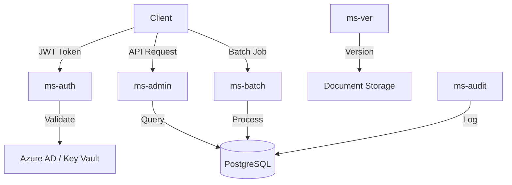

# Engine Core

**Dapr App ID:** `engine-core`
**Tech:** Java 21 / Spring Boot 3.x
**Port:** 8081

## Purpose

Consolidated service handling authentication, administration, batch operations, versioning, and audit logging for the Report Platform.

## Modules

Consolidated from:
- `ms-auth` - Authentication & Authorization
- `ms-admin` - Admin Operations
- `ms-batch` - Batch Processing
- `ms-ver` - Versioning
- `ms-audit` - Audit Logging

## Architecture



## API

### Authentication (ms-auth)
- `POST /api/v1/auth/login` - User login
- `GET /api/v1/auth/verify` - Verify token
- `POST /api/v1/auth/switch-org` - Switch organization

### Administration (ms-admin)
- `GET /api/v1/admin/users` - List users
- `POST /api/v1/admin/users` - Create user
- `PUT /api/v1/admin/users/{id}` - Update user
- `GET /api/v1/admin/organizations` - List organizations

### Batch Operations (ms-batch)
- `GET /api/v1/batch/jobs` - List batch jobs
- `POST /api/v1/batch/jobs` - Create batch job
- `GET /api/v1/batch/jobs/{id}` - Get job status

### Versioning (ms-ver)
- `POST /api/v1/versions` - Create version
- `GET /api/v1/versions/{id}` - Get version
- `GET /api/v1/versions/document/{docId}` - Get document versions

### Audit (ms-audit)
- `GET /api/v1/audit/logs` - Query audit logs
- `GET /api/v1/audit/logs/{id}` - Get audit entry

## Configuration

```yaml
server:
  port: 8081
spring:
  application:
    name: engine-core
dapr:
  app-id: engine-core
  pubsub:
    name: reportplatform-pubsub
  statestore:
    name: reportplatform-statestore
```

## Running

```bash
# Local development
cd apps/engine/engine-core
mvn spring-boot:run

# Docker
docker build -f apps/engine/engine-core/Dockerfile -t engine-core .
docker run -p 8081:8081 engine-core
```
