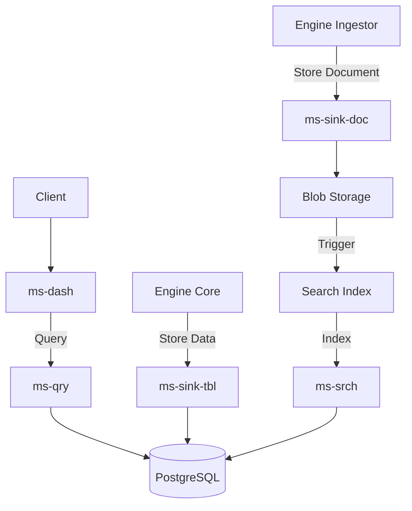

# Engine Data

**Dapr App ID:** `engine-data`
**Tech:** Java 21 / Spring Boot 3.x
**Port:** 8100

## Purpose

Consolidated data layer service handling data sinks, queries, dashboards, search, and template management for the Report Platform.

## Modules

Consolidated from:
- `ms-sink-tbl` - Table Data Sink
- `ms-sink-doc` - Document Sink
- `ms-sink-log` - Processing Log Sink
- `ms-qry` - Data Query
- `ms-dash` - Dashboard
- `ms-srch` - Search
- `ms-tmpl` - Template Management

## Architecture



## API

### Dashboard (ms-dash)
- `GET /api/v1/dashboards` - List dashboards
- `POST /api/v1/dashboards` - Create dashboard
- `GET /api/v1/dashboards/{id}` - Get dashboard
- `GET /api/v1/dashboards/{id}/data` - Get dashboard data
- `POST /api/v1/dashboards/compare` - Compare periods

### Query (ms-qry)
- `POST /api/v1/query` - Execute query
- `GET /api/v1/query/history` - Query history

### Search (ms-srch)
- `GET /api/v1/search` - Search documents
- `POST /api/v1/search/index` - Reindex

### Template (ms-tmpl)
- `GET /api/v1/templates` - List templates
- `POST /api/v1/templates` - Create template
- `GET /api/v1/templates/{id}` - Get template
- `POST /api/v1/templates/{id}/map` - Create mapping

### Sink (ms-sink-tbl, ms-sink-doc, ms-sink-log)
- gRPC services for data ingestion
- Pub/Sub handlers for data storage events

## Configuration

```yaml
server:
  port: 8100
spring:
  application:
    name: engine-data
dapr:
  app-id: engine-data
  pubsub:
    name: reportplatform-pubsub
  statestore:
    name: reportplatform-statestore
```

## Running

```bash
# Local development
cd apps/engine/engine-data
mvn spring-boot:run

# Docker
docker build -f apps/engine/engine-data/Dockerfile -t engine-data .
docker run -p 8100:8100 engine-data
```
