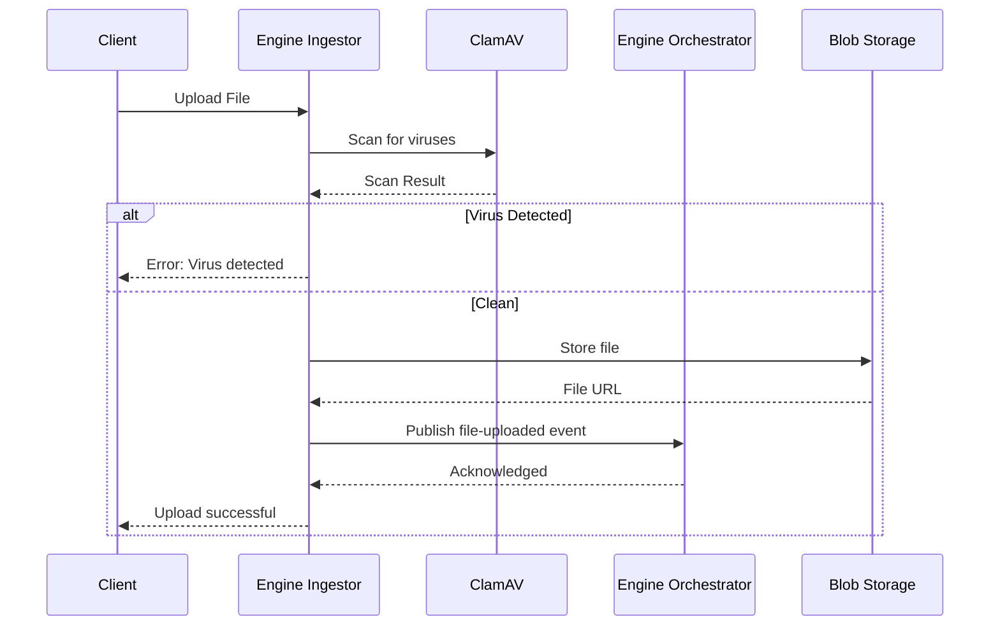

# Engine Ingestor

**Dapr App ID:** `engine-ingestor`
**Tech:** Java 21 / Spring Boot 3.x
**Port:** 8082

## Purpose

File ingestion service responsible for receiving uploaded files, scanning for viruses, and triggering the processing workflow.

## Modules

- File Upload Handler
- ClamAV Virus Scanner Integration

## Architecture



## API

### File Upload
- `POST /api/v1/upload` - Upload file
- `GET /api/v1/upload/{id}/status` - Get upload status
- `DELETE /api/v1/upload/{id}` - Delete uploaded file

## Configuration

```yaml
server:
  port: 8082
spring:
  application:
    name: engine-ingestor
dapr:
  app-id: engine-ingestor
  pubsub:
    name: reportplatform-pubsub
```

## Running

```bash
# Local development
cd apps/engine/engine-ingestor
mvn spring-boot:run

# Docker
docker build -f apps/engine/engine-ingestor/Dockerfile -t engine-ingestor .
docker run -p 8082:8082 engine-ingestor
```

## Dependencies

- ClamAV virus scanner (Docker: clamav)
- Blob storage (Azure Blob Storage / Azurite)
- Dapr sidecar
