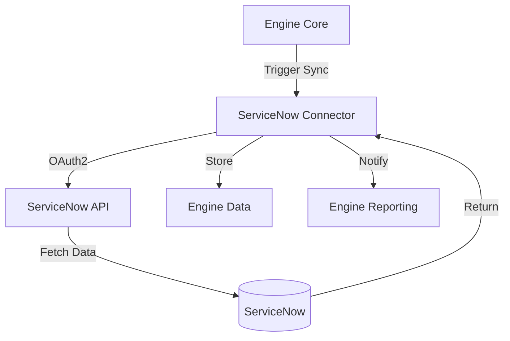

# Engine Integrations

**Dapr App ID:** `engine-integrations`
**Tech:** Java 21 / Spring Boot 3.x
**Port:** 8107

## Purpose

Integration service for external systems, primarily ServiceNow synchronization for the Report Platform.

## Modules

- `ms-ext-snow` - ServiceNow Integration

## Architecture



## API

### ServiceNow Integration
- `POST /api/v1/snow/sync` - Trigger manual sync
- `GET /api/v1/sync/status` - Get sync status
- `GET /api/v1/snow/records` - Get synced records

## Configuration

```yaml
server:
  port: 8107
spring:
  application:
    name: engine-integrations
dapr:
  app-id: engine-integrations
  pubsub:
    name: reportplatform-pubsub
servicenow:
  instance-url: ${SERVICENOW_INSTANCE_URL}
  auth-type: oauth2
  client-id: ${SERVICENOW_CLIENT_ID}
  client-secret: ${SERVICENOW_CLIENT_SECRET}
```

## Running

```bash
# Local development
cd apps/engine/engine-integrations
mvn spring-boot:run

# Docker
docker build -f apps/engine/engine-integrations/Dockerfile -t engine-integrations .
docker run -p 8107:8107 engine-integrations
```

## Topics

- `snow.sync.completed` - Published when ServiceNow sync completes
- `snow.sync.failed` - Published when ServiceNow sync fails
