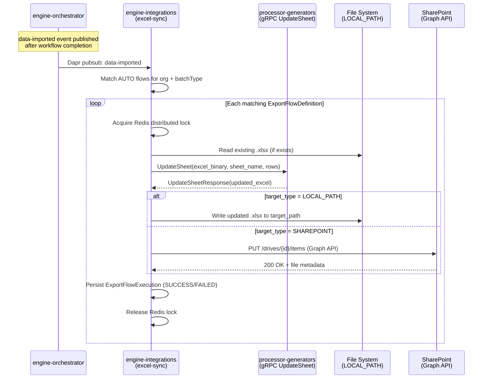

# excel-sync – Live Excel Export & External Sync (FS27)

Module within **engine-integrations** that exports query results into existing Excel workbooks and syncs them to either a local/network path or a SharePoint document library.

## Architecture



## REST API

Base path: `/api/export-flows`

| Method | Path | Role | Description |
|--------|------|------|-------------|
| `GET`  | `/health` | public | Module health: `{ status, localPath, sharepoint }` |
| `GET`  | `/` | VIEWER+ | List all active export flows for the org |
| `GET`  | `/{id}` | VIEWER+ | Get single export flow definition |
| `POST` | `/` | EDITOR+ | Create export flow |
| `PUT`  | `/{id}` | EDITOR+ | Update export flow |
| `DELETE` | `/{id}` | EDITOR+ | Soft-delete (sets `is_active=false`) |
| `POST` | `/{id}/execute` | EDITOR+ | Manual trigger → returns `executionId` |
| `GET`  | `/{id}/executions` | VIEWER+ | Paginated execution history |
| `POST` | `/{id}/test` | EDITOR+ | Dry run: preview rows without writing file |

## Configuration Reference

All properties under the `excel-sync` prefix in `application.yml`:

| Property | Env Variable | Default | Description |
|----------|-------------|---------|-------------|
| `excel-sync.enabled` | `EXCEL_SYNC_ENABLED` | `true` | Enable/disable module |
| `excel-sync.thread-pool-size` | `EXCEL_SYNC_THREAD_POOL_SIZE` | `4` | Max concurrent export workers |
| `excel-sync.allowed-paths` | `EXCEL_SYNC_ALLOWED_PATHS` | `/mnt/exports` | Allowed local target paths (comma-sep) |
| `excel-sync.container-path-prefix` | `EXCEL_SYNC_CONTAINER_PATH_PREFIX` | `/mnt/exports/` | Prepended to relative target_path |
| `excel-sync.lock-ttl-ms` | `EXCEL_SYNC_LOCK_TTL` | `300000` | Redis lock TTL (ms) |
| `excel-sync.lock-retry-count` | `EXCEL_SYNC_LOCK_RETRY_COUNT` | `3` | Lock acquisition retries |
| `excel-sync.lock-retry-interval-ms` | `EXCEL_SYNC_LOCK_RETRY_INTERVAL` | `5000` | Delay between lock retries (ms) |
| `excel-sync.max-file-size-mb` | `EXCEL_SYNC_MAX_FILE_SIZE_MB` | `50` | Max allowed .xlsx file size |
| `sharepoint.token-cache-ttl-seconds` | `SHAREPOINT_TOKEN_CACHE_TTL` | `3300` | OAuth2 token cache TTL (55 min) |

## Local Path Setup (Docker Volume)

1. In `infra/docker/.env`, set:
   ```
   EXCEL_EXPORT_HOST_PATH=./data/exports   # or \\server\share for network share
   ```
2. The host directory is mounted into the container at `/mnt/exports`.
3. Create the directory if it doesn't exist:
   ```bash
   mkdir -p infra/docker/data/exports
   ```
4. Export flows with `target_type=LOCAL_PATH` write to paths beneath `/mnt/exports/`.

## SharePoint Setup (Azure AD App Registration)

### 1. Register an Azure AD Application

In [Azure Portal](https://portal.azure.com) → **Azure Active Directory** → **App Registrations** → **New registration**:

| Field | Value |
|-------|-------|
| Name | `RA Excel Sync` |
| Supported account types | Accounts in this organizational directory only (single tenant) |
| Redirect URI | *(leave blank – app-only flow)* |

After registration, note the **Application (client) ID** and **Directory (tenant) ID** from the Overview page.

### 2. Grant API Permissions

Navigate to **API Permissions** → **Add a permission** → **Microsoft Graph** → **Application permissions**:

| Permission | Purpose |
|-----------|---------|
| `Sites.ReadWrite.All` | Read/write files in any SharePoint site |
| `Files.ReadWrite.All` | Alternative: scoped to Files only |

Click **Grant admin consent for [your tenant]** — the Status column must show a green checkmark.

> **Minimum scope**: Use `Sites.Selected` (preview) if you want to restrict access to specific site collections. Requires additional configuration via Graph API.

### 3. Create a Client Secret

**Certificates & Secrets** → **Client secrets** → **New client secret**:
- Description: `RA Excel Sync production`
- Expiry: 24 months (set a calendar reminder to rotate before it expires)

**Immediately** store the generated secret value in Azure Key Vault:

```bash
az keyvault secret set \
  --vault-name <your-keyvault-name> \
  --name "ra-sharepoint-client-secret" \
  --value "<paste-secret-here>"
```

### 4. Configure Environment Variables

```bash
# Required
AZURE_KEYVAULT_URI=https://<your-keyvault-name>.vault.azure.net
SHAREPOINT_TENANT_ID=<Directory (tenant) ID>
SHAREPOINT_CLIENT_ID=<Application (client) ID>
SHAREPOINT_SECRET_KEYVAULT_REF=ra-sharepoint-client-secret

# Optional: override token cache TTL (default 55 min)
SHAREPOINT_TOKEN_CACHE_TTL=3300
```

For **local development** without Azure Key Vault, set the secret in-memory via `KeyVaultService.setSecret()` in a `@PostConstruct` bean or test setup.

### 5. Configure the Export Flow

When creating or updating an export flow, set `target_type=SHAREPOINT` and provide `sharepoint_config`:

```json
{
  "tenantId": "xxxxxxxx-xxxx-xxxx-xxxx-xxxxxxxxxxxx",
  "clientId": "yyyyyyyy-yyyy-yyyy-yyyy-yyyyyyyyyyyy",
  "secretKeyVaultRef": "ra-sharepoint-client-secret",
  "siteUrl": "https://contoso.sharepoint.com/sites/Finance",
  "driveName": "Documents",
  "folderPath": "Reports/2026"
}
```

| Field | Description |
|-------|-------------|
| `tenantId` | Azure AD tenant GUID |
| `clientId` | App registration client ID |
| `secretKeyVaultRef` | Key Vault secret name (or `keyvault://secret-name` URI) |
| `siteUrl` | Full URL of the SharePoint site |
| `driveName` | Document library name (e.g. `Documents`) |
| `folderPath` | Relative folder within the library. The Excel file is placed here. |

### 6. Verify the Connection

Use the **test connection** REST endpoint before saving the flow:

```bash
POST /api/export-flows/{id}/test
```

The response shows whether the SQL query runs successfully and returns a 5-row preview. A separate SharePoint reachability check is performed during actual execution (not the dry-run).

To test the SharePoint auth directly:

```bash
curl -s -X POST http://localhost:8110/api/export-flows/{id}/execute \
  -H "X-Org-Id: <org-id>" \
  -H "X-User-Id: test-user" \
  -H "X-Roles: ADMIN"
```

Check the execution result via `GET /api/export-flows/{id}/executions` for `SUCCESS` or `FAILED` status with error details.

## Database Schema

Tables live in the `integrations` schema (Flyway migration `V1_0_4`):

- **`export_flow_definitions`** – flow configuration, RLS by `org_id`
- **`export_flow_executions`** – execution log per run, RLS by `org_id`

## Module Structure

```
excel-sync/
├── config/
│   ├── ExcelSyncConfig.java         # Thread pool, @EnableAsync
│   └── ExcelSyncProperties.java     # @ConfigurationProperties("excel-sync")
├── connector/
│   ├── FileConnector.java           # Interface: read/write Excel bytes
│   ├── LocalPathWriter.java         # LOCAL_PATH implementation
│   ├── SharePointConnector.java     # SHAREPOINT implementation (Graph API)
│   ├── SharePointConfig.java        # Per-flow SP config deserialized from JSONB
│   └── SharePointPathResolver.java  # Builds Graph API drive item URLs
├── controller/
│   └── ExportFlowController.java    # REST endpoints (/api/export-flows/*)
├── model/
│   ├── dto/                         # Request/response DTOs
│   └── entity/                      # JPA entities + enums
├── pubsub/
│   └── DataImportedSubscriber.java  # @Topic("data-imported") handler
├── repository/
│   ├── ExportFlowDefinitionRepository.java
│   └── ExportFlowExecutionRepository.java
└── service/
    ├── ExportFlowService.java       # CRUD + testFlow
    ├── ExportFlowExecutionService.java  # Async execution orchestration
    ├── ConcurrencyGuard.java        # Redis distributed lock wrapper
    └── FileConnectorFactory.java    # Selects LOCAL/SP connector by target_type
```
