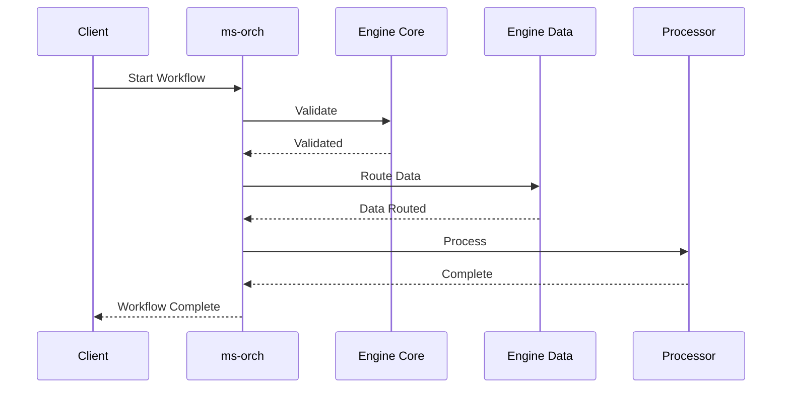

# Microservice Orchestrator (ms-orch)

**Dapr App ID:** `ms-orch`
**Tech:** Java 21 / Spring Boot 3.x
**Port:** 8083 (HTTP), 50051 (gRPC)

## Purpose

Orchestration service implementing state machine and saga patterns for coordinating complex workflows across the Report Platform.

## Modules

- State Machine Controller
- Saga Orchestrator
- Workflow Service
- gRPC Service

## Architecture



## API

### REST Endpoints
- `POST /api/v1/workflows/start` - Start workflow
- `GET /api/v1/workflows/{id}` - Get workflow status
- `POST /api/v1/workflows/{id}/cancel` - Cancel workflow

### gRPC Services
- `ProcessFile` - Process uploaded file
- `GenerateReport` - Trigger report generation

## Configuration

```yaml
server:
  port: 8083
grpc:
  server:
    port: 50051
spring:
  application:
    name: ms-orch
dapr:
  app-id: ms-orch
  pubsub:
    name: reportplatform-pubsub
  statestore:
    name: reportplatform-statestore
```

## Running

```bash
# Local development
cd apps/engine/engine-orchestration
mvn spring-boot:run

# Docker
docker build -f apps/engine/engine-orchestration/Dockerfile -t engine-orchestrator .
docker run -p 8083:8083 -p 50051:50051 engine-orchestrator
```

## Topics

- `file-uploaded` - Subscribes to trigger file processing
- `processing-completed` - Publishes when processing completes
- `pptx.generation_requested` - Triggers PPTX generation
- `pptx.generation_completed` - Receives generation completion
- `notify` - Publishes notifications
