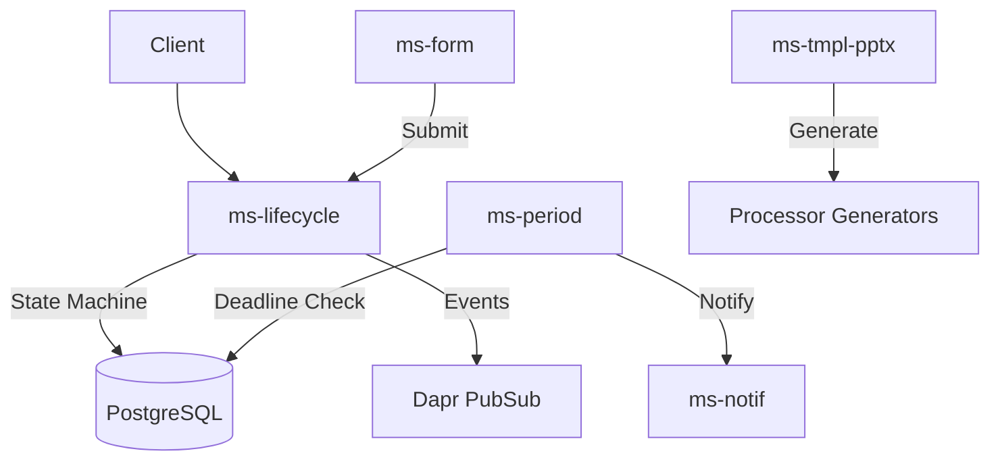

# Engine Reporting

**Dapr App ID:** `engine-reporting`
**Tech:** Java 21 / Spring Boot 3.x
**Port:** 8105

## Purpose

Consolidated reporting service handling report lifecycle, periods, forms, PPTX templates, and notifications.

## Modules

Consolidated from:
- `ms-lifecycle` - Report Lifecycle Management
- `ms-period` - Period Management
- `ms-form` - Form Management
- `ms-tmpl-pptx` - PPTX Template
- `ms-notif` - Notifications

## Architecture



## API

### Lifecycle (ms-lifecycle)
- `GET /api/v1/reports` - List reports
- `POST /api/v1/reports` - Create report
- `GET /api/v1/reports/{id}` - Get report
- `PUT /api/v1/reports/{id}/status` - Update status
- `POST /api/v1/reports/{id}/submit` - Submit report
- `POST /api/v1/reports/{id}/approve` - Approve report
- `POST /api/v1/reports/{id}/reject` - Reject report

### Period (ms-period)
- `GET /api/v1/periods` - List periods
- `POST /api/v1/periods` - Create period
- `GET /api/v1/periods/{id}` - Get period
- `PUT /api/v1/periods/{id}` - Update period

### Form (ms-form)
- `GET /api/v1/forms` - List forms
- `POST /api/v1/forms` - Create form
- `GET /api/v1/forms/{id}` - Get form
- `POST /api/v1/forms/{id}/publish` - Publish form
- `POST /api/v1/forms/{id}/response` - Submit form response

### Template (ms-tmpl-pptx)
- `GET /api/v1/templates` - List templates
- `POST /api/v1/templates` - Create template
- `GET /api/v1/templates/{id}` - Get template
- `POST /api/v1/templates/{id}/generate` - Generate PPTX

## Configuration

```yaml
server:
  port: 8105
spring:
  application:
    name: engine-reporting
dapr:
  app-id: engine-reporting
  pubsub:
    name: reportplatform-pubsub
  statestore:
    name: reportplatform-statestore
```

## Running

```bash
# Local development
cd apps/engine/engine-reporting
mvn spring-boot:run

# Docker
docker build -f apps/engine/engine-reporting/Dockerfile -t engine-reporting .
docker run -p 8105:8105 engine-reporting
```

## Topics

- `report.status_changed` - Published on report status transition
- `report.data_locked` - Published when report is approved
- `report.local_released` - Published when local scope data is released
- `form.response.submitted` - Published on form submission
