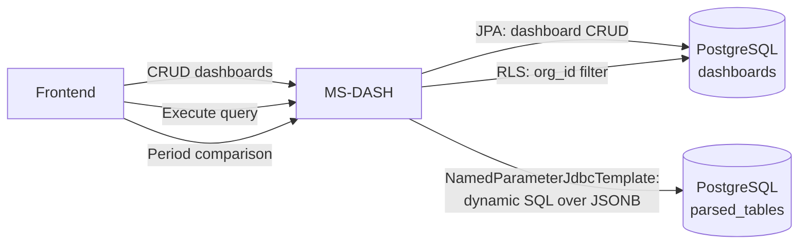

# MS-DASH - Dashboard Aggregation Service

Dashboard aggregation microservice for Report Platform. Provides CRUD operations for dashboard configurations and a dynamic SQL engine for aggregating JSONB data stored in `parsed_tables`.

## Architecture



## API Endpoints

| Method | Path | Description |
|--------|------|-------------|
| GET | `/api/dashboards` | List dashboards (public + user's own) |
| POST | `/api/dashboards` | Create a new dashboard |
| GET | `/api/dashboards/{id}` | Get dashboard by ID |
| PUT | `/api/dashboards/{id}` | Update dashboard |
| DELETE | `/api/dashboards/{id}` | Delete dashboard |
| POST | `/api/dashboards/{id}/data` | Execute aggregation query |
| POST | `/api/dashboards/period-comparison` | Compare two time periods |

## Key Features

- **Dynamic JSONB Aggregation**: Queries `parsed_tables` JSONB data with dynamic GROUP BY and aggregation (SUM, AVG, COUNT, MIN, MAX)
- **Multi-level Grouping**: Supports arbitrary grouping (org, period, cost center, etc.)
- **Period Comparison**: Calculates absolute and percentage deltas between two time periods
- **Source Type Transparency**: Distinguishes between FILE and FORM data
- **Row-Level Security**: PostgreSQL RLS enforced via `org_id` session variable
- **SQL Injection Prevention**: All dynamic SQL uses parameterized queries; field names are validated against a strict whitelist

## Tech Stack

- Java 21, Spring Boot 3.3.6
- Spring Data JPA (dashboard CRUD)
- NamedParameterJdbcTemplate (dynamic aggregation queries)
- PostgreSQL with JSONB
- Flyway migrations
- Dapr for service mesh integration

## Running Locally

```bash
mvn spring-boot:run
```

## Testing

```bash
mvn test
```
