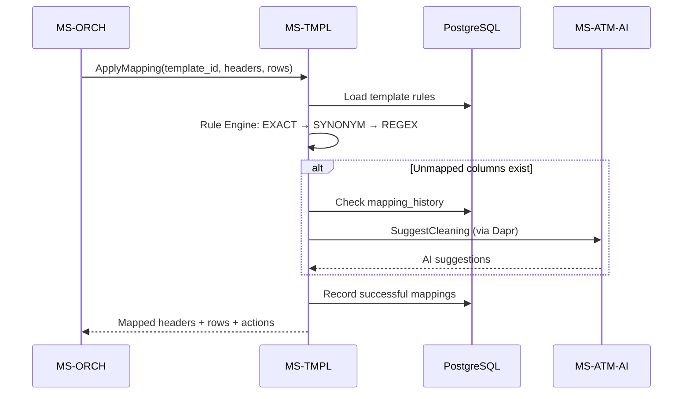

# MS-TMPL – Template & Schema Mapping Registry

**Dapr App ID:** `ms-tmpl`
**Port:** 8080 (HTTP/Actuator), gRPC via Dapr
**Stack:** Java 21 + Spring Boot 3.x + gRPC

## Purpose

Schema mapping service that applies mapping rules to extracted data before
sink writes. Supports exact match, synonym, regex, and AI-assisted rules
with learning from historical usage.

## gRPC API (template.v1.TemplateMappingService)

| RPC | Description |
|-----|-------------|
| `ApplyMapping` | Apply mapping rules from a template to extracted data |
| `SuggestMapping` | AI-assisted + history-based mapping suggestions |
| `MapExcelToForm` | Map Excel columns to form fields (FS19 prep) |

## Architecture

## Mapping Rule Priority Chain

1. **EXACT_MATCH** (confidence 1.0) – Column name equals source_pattern
2. **SYNONYM** (confidence ~0.95) – Column name in comma-separated synonym list
3. **REGEX** (confidence ~0.9) – Column name matches regex pattern
4. **HISTORY** – Previously successful mapping ranked by frequency
5. **AI_SUGGESTED** – AI-generated suggestion (min confidence 0.8)

## Configuration

| Variable | Default | Description |
|----------|---------|-------------|
| `DB_HOST` | `localhost` | PostgreSQL host |
| `DB_NAME` | `reportplatform` | Database name |
| `DB_USERNAME` | `ms_tmpl` | Database user |
| `MAPPING_AI_ENABLED` | `true` | Enable AI-assisted suggestions |
| `MAPPING_AI_DAPR_APP_ID` | `ms-atm-ai` | Dapr app ID for AI service |

## Database Tables

- `mapping_templates` – Versioned template definitions (org-scoped or global)
- `mapping_rules` – Individual rules within templates
- `mapping_history` – Successful mapping log for learning
