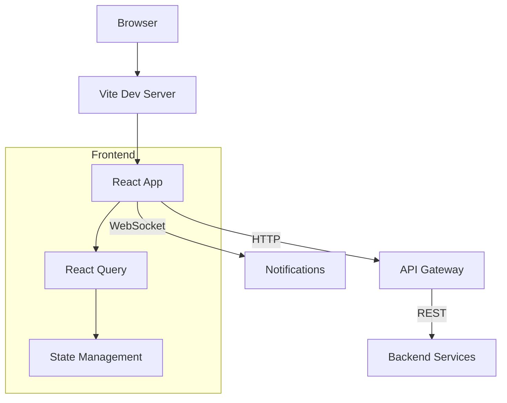

# Frontend

**Tech:** React 18+ (Vite) / TypeScript
**Port:** 5173 (dev), 80 (prod)

## Purpose

Single Page Application (SPA) for the Report Platform providing user interface for report management, dashboard viewing, form submission, and admin operations.

## Architecture



## Tech Stack

- **Framework:** React 18+ with Vite
- **Language:** TypeScript
- **State Management:** TanStack Query (React Query)
- **Styling:** Tailwind CSS + Fluent UI
- **Routing:** React Router DOM
- **HTTP Client:** Axios with interceptors

## Key Pages

- Dashboard - Overview and KPIs
- Reports - Report lifecycle management
- Forms - Form submission and viewing
- Templates - Template management
- Batch Generation - Bulk report generation
- Comparison - Period comparison
- Admin - User and organization management

## Configuration

```typescript
// Environment variables
VITE_API_URL=http://localhost
VITE_OTEL_COLLECTOR_URL=http://localhost:4318
```

## Running

```bash
# Install dependencies
cd apps/frontend
npm install

# Development
npm run dev

# Production build
npm run build

# Docker
docker build -f apps/frontend/Dockerfile -t frontend .
docker run -p 80:80 frontend
```

## Project Structure

```
apps/frontend/
├── src/
│   ├── components/     # Reusable components
│   ├── pages/          # Page components
│   ├── hooks/          # Custom React hooks
│   ├── services/       # API services
│   ├── types/          # TypeScript types
│   └── utils/          # Utility functions
├── public/             # Static assets
└── package.json
```

## Dependencies

- @tanstack/react-query
- react-router-dom
- axios
- @fluentui/react-components
- tailwindcss
