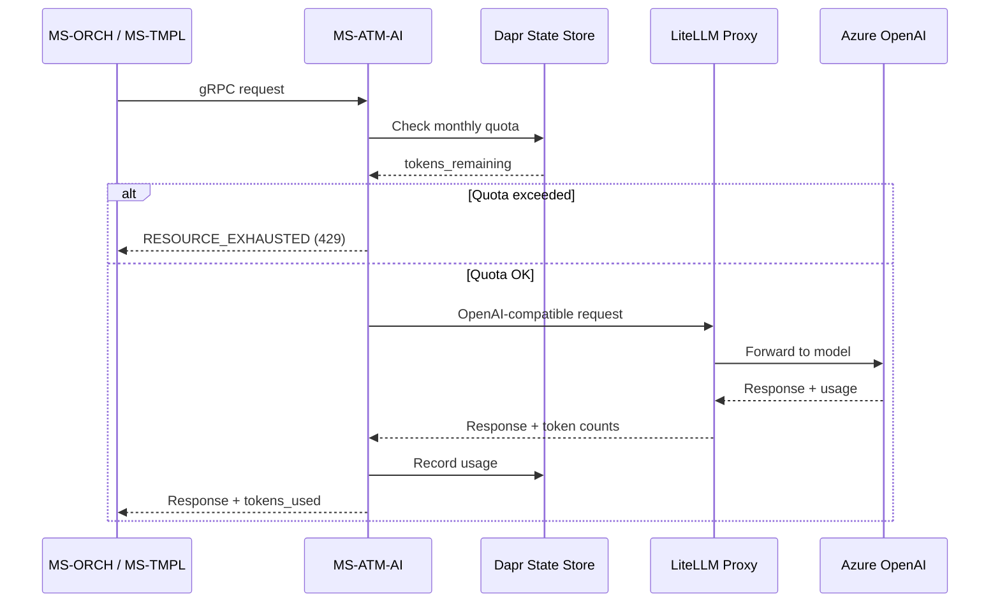

# MS-ATM-AI – AI Gateway

**Dapr App ID:** `ms-atm-ai`
**Port:** 50051 (gRPC)
**Stack:** Python 3.12 + FastAPI + gRPC

## Purpose

AI Gateway service providing semantic analysis, vector embeddings, and data
cleaning suggestions via the LiteLLM proxy (OpenAI-compatible API). All LLM
calls in the platform are routed through this service to enforce quotas,
rate limits, and consistent prompt management.

## gRPC API (atomizer.v1.AiGatewayService)

| RPC | Description |
|-----|-------------|
| `AnalyzeSemantic` | Text classification, summarization, entity extraction |
| `GenerateEmbeddings` | Vector embeddings (1536-dim) for pgVector storage |
| `SuggestCleaning` | Column name normalization and type detection |

## Architecture

## Configuration

| Variable | Default | Description |
|----------|---------|-------------|
| `LITELLM_BASE_URL` | `http://localhost:4000` | LiteLLM proxy URL |
| `LITELLM_API_KEY` | `sk-local-dev-key` | API key for LiteLLM |
| `MODEL_SEMANTIC` | `gpt-4o` | Model for analysis tasks |
| `MODEL_EMBEDDING` | `text-embedding-3-small` | Model for embeddings |
| `MAX_CONCURRENT_PER_ORG` | `5` | Max concurrent requests per org |
| `DEFAULT_MONTHLY_TOKEN_QUOTA` | `1000000` | Monthly token limit per org |
