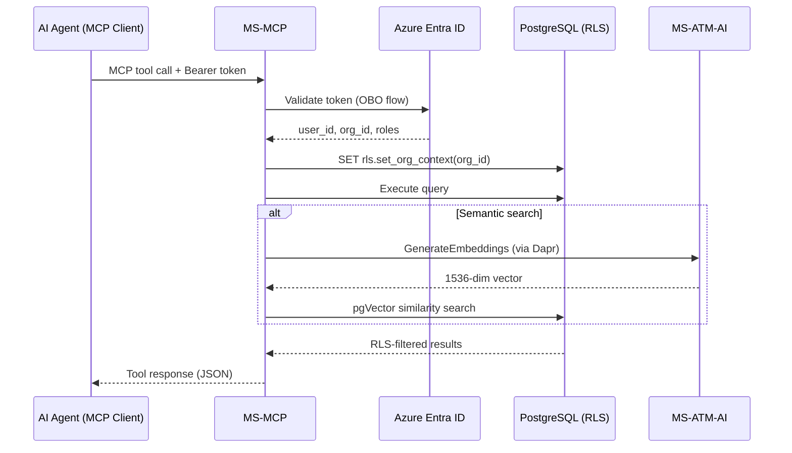

# MS-MCP – MCP Server (AI Agent Interface)

**Dapr App ID:** `ms-mcp`
**Port:** 8000 (HTTP)
**Stack:** Python 3.12 + FastAPI

## Purpose

Model Context Protocol (MCP) server that provides AI agents with tools to
query OPEX data, search documents, check report status, and compare periods.
All queries are scoped to the authenticated user's organization via RLS.

## MCP Tools

| Tool | Description |
|------|-------------|
| `query_opex_data` | Query aggregated OPEX data by period and metric |
| `search_documents` | Semantic or text search on stored documents |
| `get_report_status` | Submission matrix for a reporting period |
| `compare_periods` | Delta analysis between two periods |

## Architecture

## Security

- **OBO Flow**: User's OAuth token exchanged for downstream API token
- **RLS**: Every DB query scoped to user's `org_id` via PostgreSQL RLS
- **Cross-tenant**: Returns empty results (not errors) for data in other orgs
- **Quota**: Shared monthly token quota with MS-ATM-AI for semantic search

## Configuration

| Variable | Default | Description |
|----------|---------|-------------|
| `DB_HOST` | `localhost` | PostgreSQL host |
| `DB_USER` | `ms_qry` | Database user (read-only) |
| `AZURE_TENANT_ID` | `common` | Azure Entra ID tenant |
| `AZURE_CLIENT_ID` | `` | Azure app registration client ID |
| `DAPR_HOST` | `localhost` | Dapr sidecar host |
