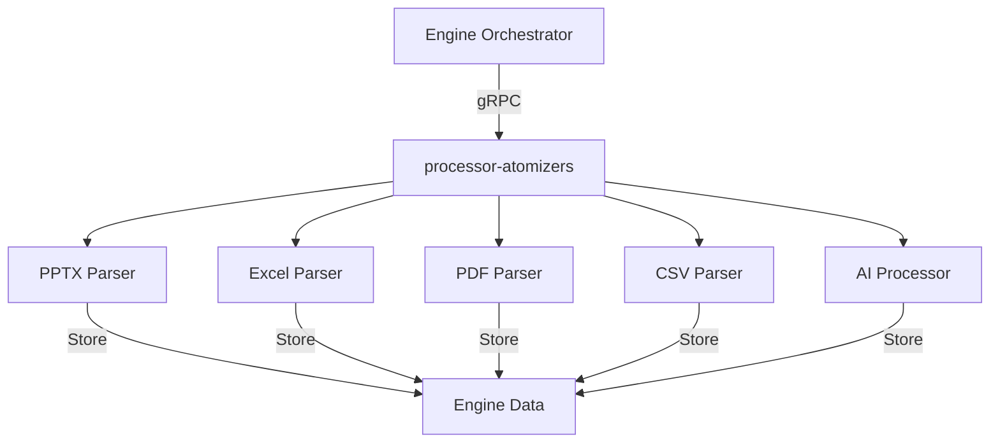

# Processor Atomizers

**Dapr App ID:** `processor-atomizers`
**Tech:** Python 3.11 / FastAPI
**Port:** 8088 (HTTP), 50200 (gRPC)

## Purpose

Data processing service containing multiple atomizers for parsing and processing various file formats (PPTX, XLS, PDF, CSV) and AI processing.

## Modules

Consolidated from:
- `ms-atm-pptx` - PPTX Atomizer
- `ms-atm-xls` - Excel Atomizer
- `ms-atm-pdf` - PDF Atomizer
- `ms-atm-csv` - CSV Atomizer
- `ms-atm-ai` - AI Atomizer
- `ms-atm-cln` - Cleanup Atomizer

## Architecture



## gRPC Services

### AtomizerService
- `ParsePptx` - Parse PPTX files
- `ParseXls` - Parse Excel files
- `ParsePdf` - Parse PDF files
- `ParseCsv` - Parse CSV files
- `ProcessWithAi` - AI processing

## Configuration

```yaml
server:
  port: 8088
grpc:
  port: 50200
dapr:
  app-id: processor-atomizers
```

## Running

```bash
# Local development
cd apps/processor/processor-atomizers
pip install -r requirements.txt
python -m uvicorn src.main:app --reload

# Docker
docker build -f apps/processor/processor-atomizers/Dockerfile -t processor-atomizers .
docker run -p 8088:8088 -p 50200:50200 processor-atomizers
```

## Dependencies

- LiteLLM for AI processing
- Dapr sidecar
- Blob storage
