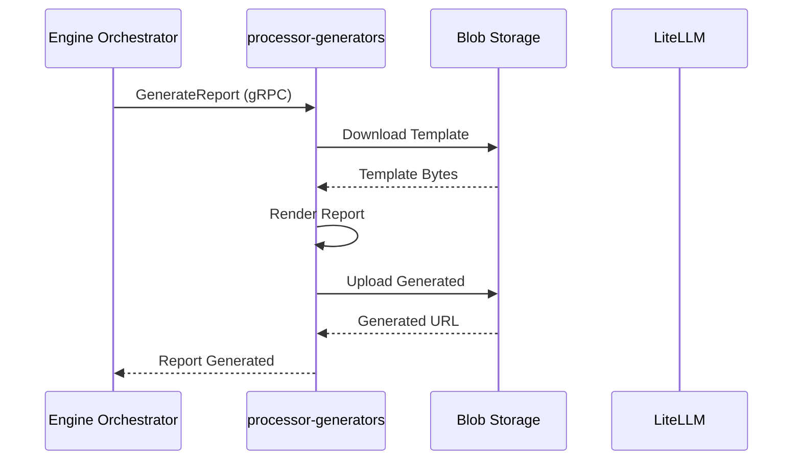

# Processor Generators

**Dapr App ID:** `processor-generators`
**Tech:** Python 3.11 / FastAPI
**Port:** 8111 (HTTP), 50091 (gRPC)

## Purpose

Report generation service for creating PPTX and Excel reports, plus MCP server for AI-assisted database queries.

## Modules

Consolidated from:
- `ms-gen-pptx` - PPTX Report Generator
- `ms-gen-xls` - Excel Report Generator
- `ms-mcp` - Model Context Protocol Server

## Architecture



## gRPC Services

### PptxGeneratorService
- `GenerateReport` - Generate single PPTX report
- `BatchGenerate` - Generate multiple reports

### ExcelGeneratorService
- `GenerateExcel` - Generate Excel report
- `BatchGenerateExcel` - Generate multiple Excel reports

### MCP Server
- REST endpoints for AI-assisted queries
- OBO (On-Behalf-Of) authentication flow

## Configuration

```yaml
server:
  port: 8111
grpc:
  port: 50091
dapr:
  app-id: processor-generators
generation:
  timeout-seconds: 60
```

## Running

```bash
# Local development
cd apps/processor/processor-generators
pip install -r requirements.txt
python -m uvicorn src.main:app --reload

# Docker
docker build -f apps/processor/processor-generators/Dockerfile -t processor-generators .
docker run -p 8111:8111 -p 50091:50091 processor-generators
```

## Dependencies

- LiteLLM for AI processing
- Dapr sidecar
- Blob storage (Azure)
- PostgreSQL (read-only via ms_qry role)
