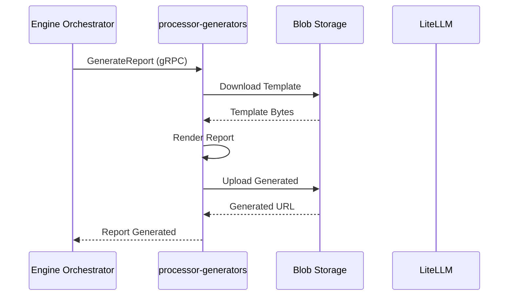

# Processor Generators

**Dapr App ID:** `processor-generators`
**Tech:** Python 3.11 / FastAPI
**Port:** 8111 (HTTP), 50201 (gRPC)

## Purpose

Report generation service for creating PPTX and Excel reports, plus MCP server for AI-assisted database queries.

## Modules

Consolidated from:
- `ms-gen-pptx` - PPTX Report Generator
- `ms-gen-xls` - Excel Report Generator
- `ms-mcp` - Model Context Protocol Server

## Architecture



## gRPC Services

### PptxGeneratorService
- `GenerateReport` - Generate single PPTX report
- `BatchGenerate` - Generate multiple reports

### ExcelGeneratorService
- `GenerateExcel` - Generate Excel report
- `BatchGenerateExcel` - Generate multiple Excel reports
- `UpdateSheet` - Partial sheet update: overwrite one named sheet in an existing workbook while preserving all other sheets, formatting, charts and pivot tables

#### UpdateSheet – Input/Output

```
UpdateSheetRequest {
  excel_binary  bytes          // Existing .xlsx bytes; empty → create new workbook
  sheet_name    string         // Target sheet to overwrite or create
  data_rows     UpdateSheetRow // Typed cell values (string/number/bool/date)
  headers       string[]       // Column header labels for row 1
  formatting    SheetFormatting {
    auto_filter        bool    // Excel auto-filter on header row
    freeze_header      bool    // Freeze first row
    auto_column_width  bool    // Auto-fit column widths
  }
}

UpdateSheetResponse {
  updated_excel  bytes   // Updated .xlsx binary (all other sheets preserved)
  rows_written   int32
  sheet_name     string
}
```

**Sheet preservation guarantees:**
- All sheets not named `sheet_name` are untouched (content, formatting, charts, pivot tables).
- If `sheet_name` does not exist it is created; existing content is fully replaced.
- Maximum input file size is controlled via `EXCEL_MAX_SIZE_MB` env variable (default 50 MB).
- Maximum rows per sheet: 1,048,576 (Excel limit).

### MCP Server
- REST endpoints for AI-assisted queries
- OBO (On-Behalf-Of) authentication flow

## Configuration

```yaml
server:
  port: 8111
grpc:
  port: 50201
dapr:
  app-id: processor-generators
generation:
  timeout-seconds: 60
```

## Running

```bash
# Local development
cd apps/processor/processor-generators
pip install -r requirements.txt
python -m uvicorn src.main:app --reload

# Docker
docker build -f apps/processor/processor-generators/Dockerfile -t processor-generators .
docker run -p 8111:8111 -p 50201:50201 processor-generators
```

## Dependencies

- LiteLLM for AI processing
- Dapr sidecar
- Blob storage (Azure)
- PostgreSQL (read-only via ms_qry role)
