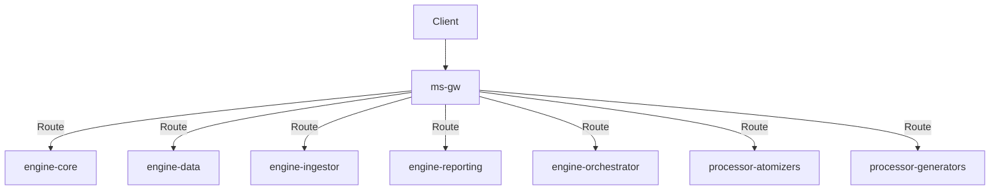

# API Gateway (ms-gw)

**Dapr App ID:** N/A (Nginx)
**Tech:** Nginx
**Port:** 80 (HTTP), 443 (HTTPS)

## Purpose

Central API Gateway handling request routing, load balancing, SSL termination, and rate limiting for the Report Platform.

## Modules

- Nginx Reverse Proxy
- Rate Limiting
- SSL/TLS Termination
- Request Routing

## Architecture



## Configuration

```nginx
server {
    listen 80;
    server_name localhost;
    
    location /api/core/ {
        proxy_pass http://engine-core:8081;
    }
    
    location /api/data/ {
        proxy_pass http://engine-data:8100;
    }
    
    location /api/upload/ {
        proxy_pass http://engine-ingestor:8082;
    }
    
    location /api/reporting/ {
        proxy_pass http://engine-reporting:8105;
    }
    
    location /api/orch/ {
        proxy_pass http://engine-orchestrator:8083;
    }
}
```

## Running

```bash
# Local development
cd apps/engine/microservices/units/ms-gw
docker build -f Dockerfile -t ms-gw .
docker run -p 80:80 -p 443:443 ms-gw
```

## Routes

| Path | Service | Description |
|------|---------|-------------|
| `/api/core/*` | engine-core | Auth, Admin, Batch, Versioning |
| `/api/data/*` | engine-data | Data queries, dashboards, search |
| `/api/upload/*` | engine-ingestor | File uploads |
| `/api/reporting/*` | engine-reporting | Reports, periods, forms |
| `/api/orch/*` | engine-orchestrator | Workflow orchestration |
| `/api/processor/*` | processor-atomizers | Data processing |
| `/api/generators/*` | processor-generators | Report generation |
