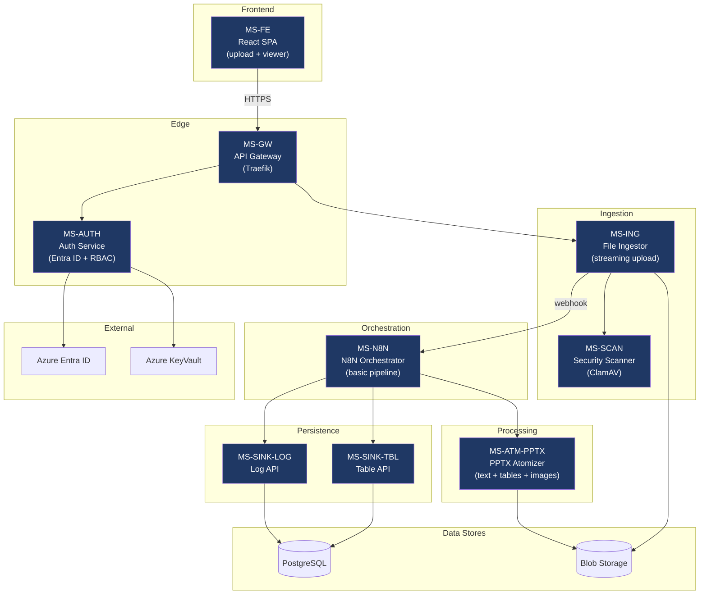
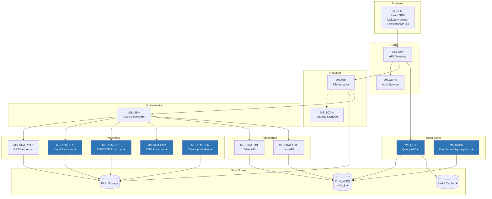
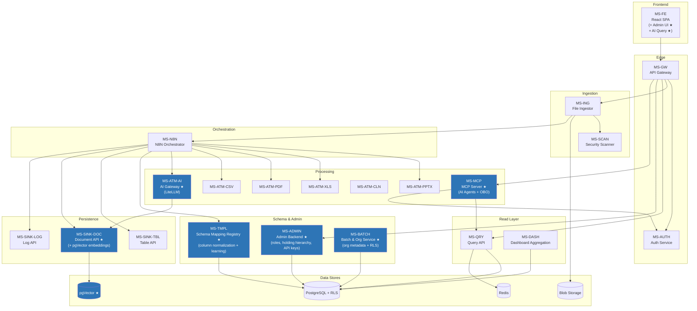
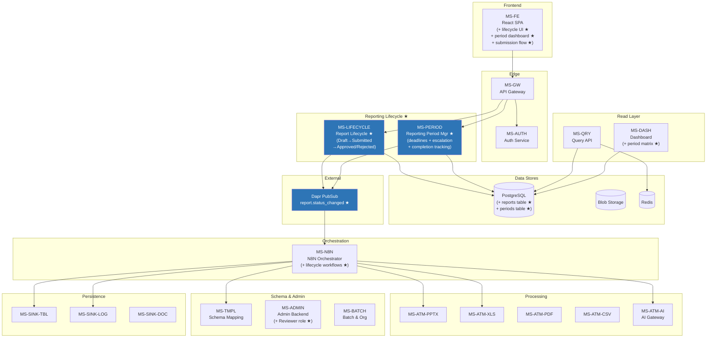
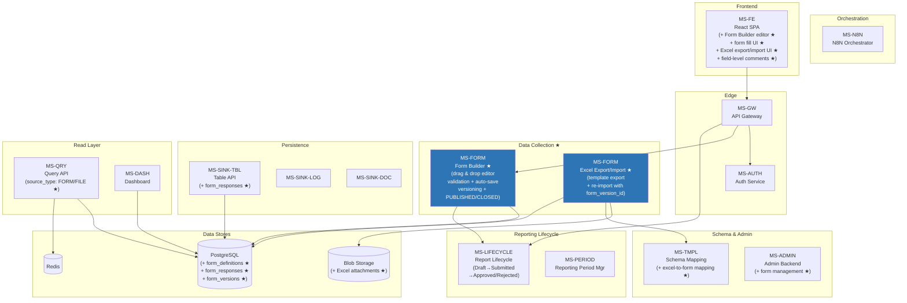
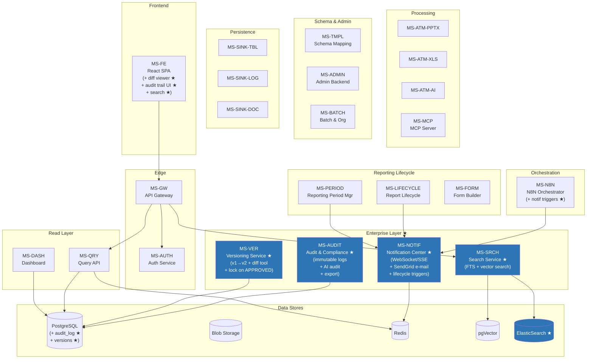
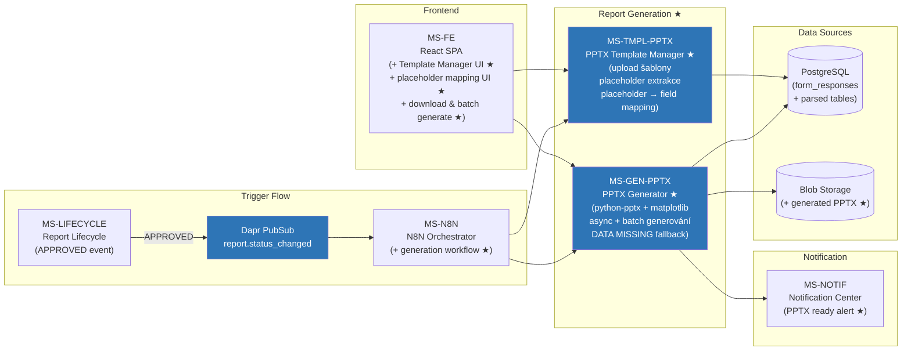
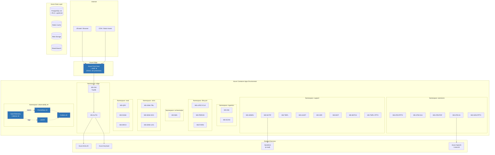
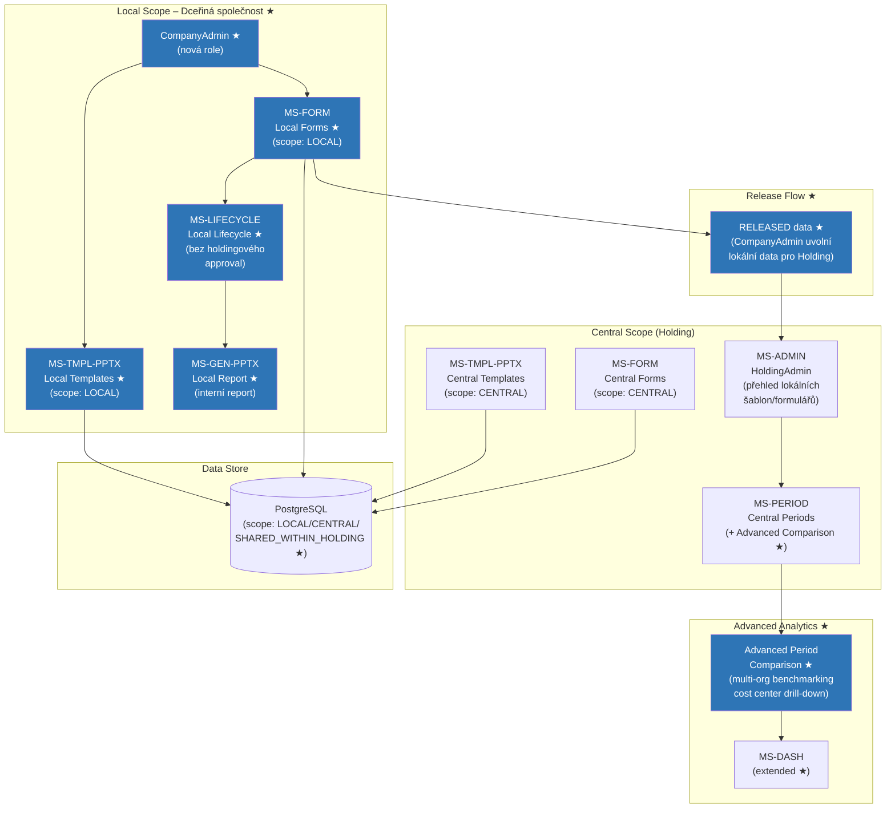

# Mermaid Diagramy – Stav systému po každé fázi
**Verze:** 1.0  
**Navazuje na:** Implementation Plan v2.1  
**Datum:** Únor 2026

> Každý diagram zobrazuje **kumulativní stav systému** po dokončení dané fáze – tedy co je živé a funkční, ne jen co bylo přidáno v dané fázi. Nové komponenty jsou vizuálně odlišeny.

---

## Phase 1 – MVP Core (M1–2)
*Upload PPTX → parsování → uložení → základní viewer*

**Po Phase 1 je živé:** 9 services · PPTX upload & extrakce · základní viewer · auth

---

## Phase 2 – Extended Parsing (M3–4)
*Plná podpora formátů + BI dashboardy · nové komponenty zvýrazněny*

**Po Phase 2 je živé:** 15 services · Excel/PDF/CSV parsování · RLS · BI dashboardy · Redis cache

---

## Phase 3 – Intelligence & Admin (M5–6)
*AI integrace + holdingová hierarchie + Schema Mapping*

**Po Phase 3 je živé:** 22 services · AI sémantická analýza · MCP agent · Schema Mapping · holdingová hierarchie

---

## Phase 3b – Reporting Lifecycle (M6–7)
*Stavový automat reportu + periody + deadliny*

**Po Phase 3b je živé:** 24 services · stavový automat reportů · periody s deadliny · matice stavu Společnost × Perioda

---

## Phase 3c – Form Builder (M7–8)
*Centrální sběr dat přes formuláře + Excel export/import*

**Po Phase 3c je živé:** 25 services · Form Builder · Excel export/import šablony · form_responses v DB · Schema Mapping pro import

---

## Phase 4 – Enterprise Features (M8–9)
*Audit · verzování · notifikace · full-text search*

**Po Phase 4 je živé:** 29 services · immutable audit log · versioning + diff · e-mail notifikace pro lifecycle events · full-text + vector search

---

## Phase 4b – PPTX Report Generation (M9–10)
*Uzavření cyklu: schválená data → standardizovaný PPTX report*

**Po Phase 4b je živé:** 31 services · kompletní OPEX lifecycle uzavřen · automatické generování PPTX po schválení dat

---

## Phase 5 – DevOps Maturity + First Holding Onboarding (M10–11)
*Produkční infrastruktura + observability + první zákazník live*

**Po Phase 5 je živé:** 31 services + observability stack · WAF · autoscaling · první holding onboardován

---

## Phase 6 – Local Scope & Advanced Analytics (M12+)
*Platforma jako standalone nástroj pro dceřiné společnosti*

**Po Phase 6 je živé:** 31 services + lokální scope · CompanyAdmin role · local forms & templates · "release" flow · advanced period comparison

---

## Kompletní architektura – Full System (po Phase 6)

```mermaid
graph TB
    subgraph "Internet & Edge"
        USER["Uživatelé\n(HoldingAdmin / Editor\n/ Viewer / CompanyAdmin)"]
        WAF["Azure Front Door + WAF"]
    end

    subgraph "Azure Container Apps"
        subgraph "Edge Layer"
            GW["MS-GW\nAPI Gateway"]
            AUTH["MS-AUTH\nAuth Service"]
        end

        subgraph "Ingestion Layer"
            ING["MS-ING\nFile Ingestor"]
            SCAN["MS-SCAN\nSecurity Scanner"]
        end

        subgraph "Lifecycle Layer"
            LIFE["MS-LIFECYCLE\nReport Lifecycle"]
            PERIOD["MS-PERIOD\nReporting Period"]
            FORM["MS-FORM\nForm Builder"]
        end

        subgraph "Orchestration Layer"
            N8N["MS-N8N\nN8N Orchestrator"]
        end

        subgraph "Processing Layer"
            PPTX["MS-ATM-PPTX"]
            XLS["MS-ATM-XLS"]
            PDF["MS-ATM-PDF"]
            CSV["MS-ATM-CSV"]
            CLN["MS-ATM-CLN"]
            AI["MS-ATM-AI\nAI Gateway"]
            GEN["MS-GEN-PPTX\nPPTX Generator"]
        end

        subgraph "Sink Layer"
            SINKTBL["MS-SINK-TBL"]
            SINKDOC["MS-SINK-DOC"]
            SINKLOG["MS-SINK-LOG"]
        end

        subgraph "Read Layer"
            QRY["MS-QRY\nQuery API"]
            DASH["MS-DASH\nDashboard Agg"]
            SRCH["MS-SRCH\nSearch"]
        end

        subgraph "Support Layer"
            ADMIN["MS-ADMIN"]
            NOTIF["MS-NOTIF"]
            TMPL["MS-TMPL\nSchema Mapping"]
            AUDIT["MS-AUDIT"]
            VER["MS-VER"]
            MCP["MS-MCP"]
            BATCH["MS-BATCH"]
            TMPLPPTX["MS-TMPL-PPTX"]
        end

        subgraph "Observability"
            OTEL["OpenTelemetry"]
            PROM["Prometheus"]
            GRAF["Grafana"]
            LOKI["Loki"]
        end
    end

    subgraph "Data Layer"
        PG[("PostgreSQL 16\n+ RLS + pgVector")]
        REDIS[("Redis")]
        BLOB[("Blob Storage")]
        ES[("ElasticSearch")]
    end

    subgraph "External"
        AAD["Azure Entra ID"]
        KV["Azure KeyVault"]
        SMTP["SendGrid"]
        LLM["Azure OpenAI"]
    end

    USER --> WAF --> GW
    GW --> AUTH --> AAD
    GW --> ING --> SCAN
    GW --> LIFE
    GW --> FORM
    GW --> PERIOD
    GW --> QRY
    GW --> ADMIN
    GW --> MCP
    ING --> BLOB
    ING --> N8N
    LIFE --> N8N
    N8N --> PPTX & XLS & PDF & CSV & AI & GEN
    N8N --> SINKTBL & SINKDOC & SINKLOG
    N8N --> TMPL & NOTIF
    GEN --> BLOB
    SINKTBL & SINKDOC & SINKLOG --> PG
    QRY --> PG & REDIS
    DASH --> PG
    SRCH --> ES & PG
    AUDIT --> PG
    VER --> PG
    NOTIF --> SMTP
    AI --> LLM
    AUTH --> KV
    OTEL -.-> PROM -.-> GRAF
    LOKI -.-> GRAF
```

**Kompletní systém:** 31 microservices · 5 databázových technologií · full OPEX lifecycle · M12+

---

*Mermaid Diagramy v1.0 | PPTX Analyzer & Automation Platform | Únor 2026*
