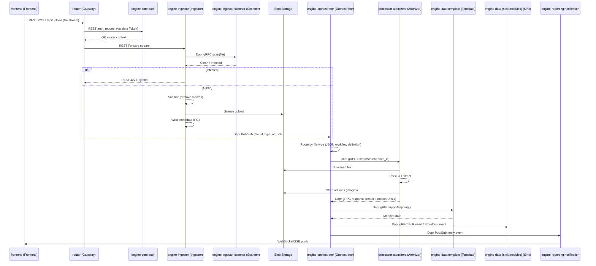
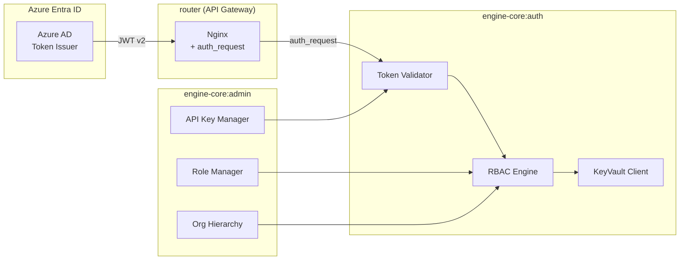
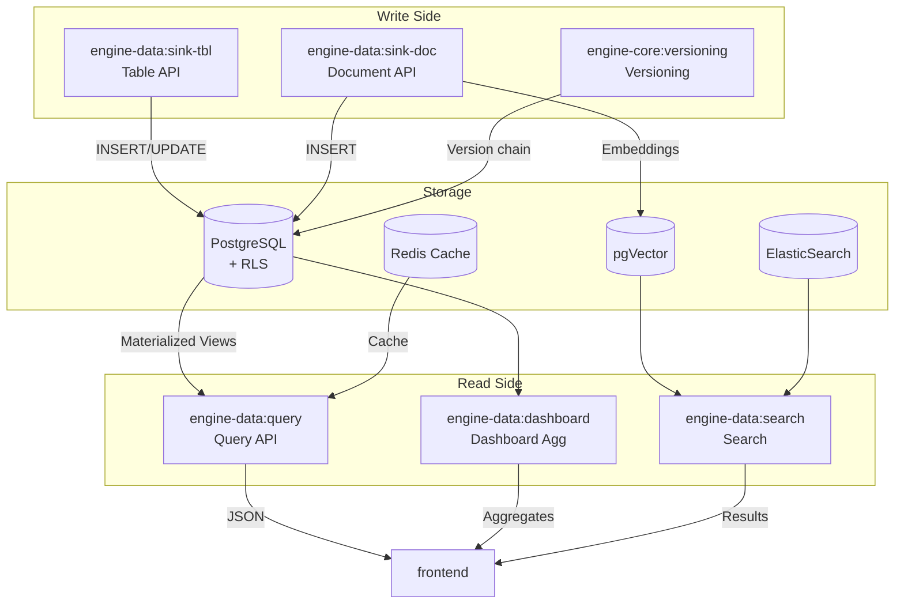
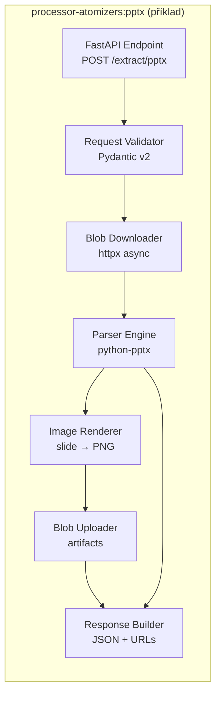

# Microservices Decomposition – PPTX Analyzer & Automation Platform
**Version:** 2.0
**Based on:** `docs/project_charter.md` v4.0
**Date:** 2026-03-09

---

## 0. HighLevel

```mermaid
graph TD
    User[User / React App] -->|HTTPS| FrontDoor[Azure Front Door / WAF]
    FrontDoor -->|Private Link| ACAEnv[Azure Container Apps Environment]
    
    subgraph "Compute Layer (ACA)"
        Ingress[Ingress Controller] --> Ingest[Ingestor Service]
        Ingest -->|Dapr PubSub| ORCH[engine-orchestrator Orchestrator]
        ORCH -->|gRPC| AtomJava[Java Atomizer]
        ORCH -->|gRPC| AtomPy[Python Atomizer]
    end

    subgraph "Data Layer"
        Ingest -->|Stream| Blob[Blob Storage]
        AtomJava -->|Read| Blob
        AtomPy -->|Read| Blob
```

---

## 1. Celkový přehled architektury (High-Level)

```mermaid
graph TB
    subgraph "Presentation Layer"
        FE[frontend<br/>Frontend SPA]
    end

    subgraph "Edge Layer"
        GW[router<br/>API Gateway]
        AUTH[engine-core:auth<br/>Auth Service]
    end

    subgraph "Ingestion Layer"
        ING[engine-ingestor<br/>File Ingestor]
        SCAN[engine-ingestor:scanner<br/>Security Scanner]
        BLOB[(Blob Storage)]
    end

    subgraph "Orchestration Layer"
        ORCH[engine-orchestrator<br/>Custom Orchestrator]
        DLQ[engine-orchestrator:dlq<br/>Dead Letter Queue]
    end

    subgraph "Processing Layer – Atomizers"
        ATM-PPTX[processor-atomizers:pptx<br/>PPTX Atomizer]
        ATM-XLS[processor-atomizers:xls<br/>Excel Atomizer]
        ATM-PDF[processor-atomizers:pdf<br/>PDF/OCR Atomizer]
        ATM-CSV[processor-atomizers:csv<br/>CSV Atomizer]
        ATM-AI[processor-atomizers:ai<br/>AI Gateway]
        ATM-CLN[processor-atomizers:cleanup<br/>Cleanup Worker]
    end

    subgraph "Persistence Layer – Sinks"
        SINK-TBL[engine-data:sink-tbl<br/>Table API]
        SINK-DOC[engine-data:sink-doc<br/>Document API]
        SINK-LOG[engine-data:sink-log<br/>Log API]
    end

    subgraph "Read / Analytics Layer"
        QRY[engine-data:query<br/>Query API]
        DASH[engine-data:dashboard<br/>Dashboard Aggregation]
        SRCH[engine-data:search<br/>Search Service]
    end

    subgraph "Support Services"
        NOTIF[engine-reporting:notification<br/>Notification Center]
        ADMIN[engine-core:admin<br/>Admin Backend]
        TMPL[engine-data:template<br/>Template Registry]
        AUDIT[engine-core:audit<br/>Audit Service]
        VER[engine-core:versioning<br/>Versioning Service]
    end

    subgraph "Data Stores"
        PG[(PostgreSQL)]
        REDIS[(Redis)]
        VECTOR[(pgVector)]
        ES[(ElasticSearch/FTS)]
    end

    FE -->|REST HTTPS| GW
    GW -->|REST auth_request| AUTH
    GW -->|REST| ING
    GW -->|REST| QRY
    GW -->|REST| ADMIN
    GW -->|REST| NOTIF

    ING -->|Dapr gRPC| SCAN
    ING --> BLOB
    ING -->|Dapr PubSub| ORCH

    ORCH -->|Dapr gRPC| ATM-PPTX
    ORCH -->|Dapr gRPC| ATM-XLS
    ORCH -->|Dapr gRPC| ATM-PDF
    ORCH -->|Dapr gRPC| ATM-CSV
    ORCH -->|Dapr gRPC| ATM-AI
    ORCH -->|Dapr gRPC| SINK-TBL
    ORCH -->|Dapr gRPC| SINK-DOC
    ORCH -->|Dapr gRPC| SINK-LOG
    ORCH -->|Dapr gRPC| TMPL
    ORCH --> DLQ

    ATM-PPTX --> BLOB
    ATM-XLS --> BLOB
    ATM-PDF --> BLOB

    SINK-TBL --> PG
    SINK-DOC --> PG
    SINK-DOC --> VECTOR
    SINK-LOG --> PG

    QRY --> PG
    QRY --> REDIS
    DASH --> PG
    SRCH --> ES

    AUDIT --> PG
    VER --> PG
    NOTIF --> REDIS

    ATM-CLN --> BLOB
```



---

## 2. Detail – Ingestion & Processing Flow

> **Protokoly:** REST se používá pouze na edge vrstvě (FE → GW → edge služby). Veškerá interní komunikace probíhá přes Dapr gRPC nebo Dapr Pub/Sub.



---

## 3. Detail – Auth & RBAC Flow



---

## 4. Detail – Data Persistence & Read Model (CQRS)



---

## 5. Katalog Microservices (Units)

| # | Unit ID | Function ID | Název | Popis | FeatureSet | Tech Stack | Effort |
|---|---------|-------------|-------|-------|------------|------------|--------|
| 1 | frontend | **frontend** | Frontend SPA | React SPA – upload, viewer, dashboardy, notifikace (WebSocket/SSE), MSAL auth | FS09, FS11 | React 18 + Vite + TS + Tailwind | **XL** |
| 2 | router | **router** | API Gateway | Nginx – Host-based routing, Azure Front Door (WAF + SSL), rate limiting (100/10 req/s, burst 20), auth_request → engine-core:auth | FS01 | Nginx (config) | **S** |
| 3 | engine-core | **engine-core:auth** | Auth Service | Validace Azure Entra ID tokenů, RBAC engine, KeyVault integrace, API key validace | FS01, FS07 | Java 21 + Spring Boot | **L** |
| 4 | engine-ingestorESTOR | **engine-ingestor** | File Ingestor | Streaming upload do Blob, MIME validace, metadata zápis, sanitizace, trigger engine-orchestrator (Dapr PubSub / gRPC) | FS02 | Java 21 + Spring Boot | **L** |
| 5 | engine-ingestorESTOR | **engine-ingestor:scanner** | Security Scanner | Antivirová kontrola přes ClamAV clamd TCP socket | FS02 | ClamAV (sidecar/container) | **S** |
| 6 | engine-orchestrator | **engine-orchestrator** | Custom Orchestrator | Workflow engine (Spring State Machine), Saga Pattern, Type-Safe Contracts, gRPC, Redis state, exponential backoff retry, DLQ | FS04 | Java 21 + Spring Boot | **XL** |
| 7 | processor-atomizers | **processor-atomizers:pptx** | PPTX Atomizer | Extrakce struktury, textů, tabulek a slide images z PPTX souborů | FS03 | Python + FastAPI | **L** |
| 8 | processor-atomizers | **processor-atomizers:xls** | Excel Atomizer | Parsování Excel souborů per-sheet do JSON, partial success handling | FS03, FS10 | Python + FastAPI | **M** |
| 9 | processor-atomizers | **processor-atomizers:pdf** | PDF/OCR Atomizer | OCR a extrakce textu ze skenovaných PDF dokumentů | FS03 | Python + FastAPI | **M** |
| 10 | processor-atomizers | **processor-atomizers:csv** | CSV Atomizer | Konverze CSV souborů na strukturovaný JSON | FS03 | Python + FastAPI | **S** |
| 11 | processor | **processor-atomizers:ai** | AI Gateway | LiteLLM integrace pro sémantickou analýzu, MetaTable logic, cost control (quotas) | FS03, FS12 | Python + FastAPI | **L** |
| 12 | processor-atomizers | **processor-atomizers:cleanup** | Cleanup Worker | Cron/sidecar pro mazání dočasných souborů z Blob storage po expiraci | FS03 | Python (CronJob) | **S** |
| 13 | engine-data | **engine-data:sink-tbl** | Table API (Sink) | Ukládání strukturovaných dat (tabulky, OPEX) do PostgreSQL | FS05 | Java 21 + Spring Boot | **M** |
| 14 | engine-data | **engine-data:sink-doc** | Document API (Sink) | Ukládání nestrukturovaného JSONu + vector embeddings (pgVector) | FS05 | Java 21 + Spring Boot | **M** |
| 15 | engine-data | **engine-data:sink-log** | Log API (Sink) | Audit trail zpracování souborů – zápis processing logů | FS05 | Java 21 + Spring Boot | **S** |
| 16 | engine-data | **engine-data:query** | Query API (Read) | CQRS read model – optimalizované čtení pro frontend, caching (Redis) | FS06 | Java 21 + Spring Boot | **M** |
| 17 | engine-data | **engine-data:dashboard** | Dashboard Aggregation | Endpointy pro grafy, souhrny, Group By / Sort, SQL nad JSON tabulkami | FS06, FS11 | Java 21 + Spring Boot | **L** |
| 18 | engine-data | **engine-data:search** | Search Service | Full-text search přes ElasticSearch / PostgreSQL FTS + vector search | FS06 | Java 21 + Spring Boot | **M** |
| 19 | engine-core | **engine-core:admin** | Admin Backend | Správa rolí (Admin/Editor/Viewer), holdingová hierarchie, secrets, API keys, Failed Jobs UI | FS07, FS08 | Java 21 + Spring Boot | **L** |
| 20 | engine-core | **engine-reporting:notification** | Notification Center | In-app notifikace (WebSocket/SSE), e-mail alerty (SMTP), granulární nastavení | FS13 | Java 21 + Spring Boot | **M** |
| 21 | engine-data | **engine-data:template** | Template & Schema Registry | UI pro mapování sloupců, learning z historie, voláno z engine-orchestrator (gRPC) před uložením | FS15 | Java 21 + Spring Boot | **L** |
| 22 | engine-core | **engine-core:versioning** | Versioning Service | Verzování dat (v1→v2), diff tool pro zobrazení změn mezi verzemi | FS14 | Java 21 + Spring Boot | **M** |
| 23 | engine-core | **engine-core:audit** | Audit & Compliance | Immutable logy (kdo-kdy-co), read access log, AI audit (prompty/odpovědi), export | FS16 | Java 21 + Spring Boot | **M** |
| 24 | processor | **processor-generators:mcp** | MCP Server (AI Agent) | Integrace AI agentů, On-Behalf-Of flow, token dědění, quotas | FS12 | Python + FastAPI | **L** |
| 25 | engine-core | **engine-core:batch** | Batch & Org Service | Seskupování souborů do batchů, holdingová metadata, RLS enforcement | FS08 | Java 21 + Spring Boot | **M** |
| 26 | engine-reporting | **engine-reporting:lifecycle** | Report Lifecycle Service | Správa stavového automatu reportů, submission checklist, rejection flow, hromadné akce | FS17 | Java 21 + Spring Boot | **L** |
| 27 | engine-reporting | **engine-reporting:pptx-template** | PPTX Template Manager | Nahrávání, verzování a správa PPTX šablon; extrakce placeholderů; mapování na datové zdroje | FS18 | Java 21 + Spring Boot | **L** |
| 28 | processor | **processor-generators:pptx** | PPTX Generator | Renderování PPTX ze zdrojových dat + šablony; placeholder substituce; grafy; batch generování | FS18 | Python + FastAPI (python-pptx, matplotlib) | **L** |
| 29 | engine-reporting | **engine-reporting:form** | Form Builder & Data Collection | Definice formulářů, správa verzí, sběr dat, validace, Excel import, napojení na engine-reporting:lifecycle | FS19 | Java 21 + Spring Boot | **XL** |
| 30 | engine-reporting | **engine-reporting:period** | Reporting Period Manager | Správa period a deadlinů, automatické uzavírání, completion tracking, eskalace, historické srovnání | FS20 | Java 21 + Spring Boot | **M** |

---

## 6. Effort Legenda

| Effort | Story Points (odhad) | Popis |
|--------|----------------------|-------|
| **S** | 3–5 | Jednoduchá služba, konfigurace nebo thin wrapper |
| **M** | 8–13 | Středně komplexní služba s vlastní business logikou |
| **L** | 13–21 | Komplexní služba s více endpointy, integrací a edge cases |
| **XL** | 21–34 | Rozsáhlá komponenta s mnoha obrazovkami / moduly |

---

## 7. Detail – Deployment Topology

```mermaid
graph TB
    subgraph "Kubernetes Cluster"
        subgraph "Namespace: edge"
            GW[router<br/>Nginx]
            AUTH[engine-core:auth<br/>+ Dapr Sidecar]
        end

        subgraph "Namespace: ingestion"
            ING[engine-ingestor<br/>+ Dapr Sidecar]
            SCAN[engine-ingestor:scanner<br/>ClamAV]
        end

        subgraph "Namespace: orchestration"
            ORCH[engine-orchestrator<br/>Custom Orchestrator<br/>+ Dapr Sidecar]
        end

        subgraph "Namespace: atomizers"
            PPTX[processor-atomizers:pptx]
            XLS[processor-atomizers:xls]
            PDF[processor-atomizers:pdf]
            CSV[processor-atomizers:csv]
            AI[processor-atomizers:ai]
            CLN[processor-atomizers:cleanup<br/>CronJob]
        end

        subgraph "Namespace: sinks"
            TBL[engine-data:sink-tbl]
            DOC[engine-data:sink-doc]
            LOG[engine-data:sink-log]
        end

        subgraph "Namespace: read"
            QRY[engine-data:query]
            DASH[engine-data:dashboard]
            SRCH[engine-data:search]
        end

        subgraph "Namespace: support"
            ADMIN[engine-core:admin]
            NOTIF[engine-reporting:notification]
            TMPL[engine-data:template]
            AUDIT[engine-core:audit]
            VER[engine-core:versioning]
            MCP[processor-generators:mcp]
            BATCH[engine-core:batch]
        end

        subgraph "Namespace: data"
            PG[(PostgreSQL)]
            REDIS[(Redis)]
            BLOB[(Blob Storage)]
            ES[(ElasticSearch)]
        end

        subgraph "Namespace: observability"
            PROM[Prometheus]
            GRAF[Grafana]
            LOKI[Loki / ELK]
            OTEL[OpenTelemetry<br/>Collector]
        end
    end

    subgraph "External"
        CDN[CDN / Static]
        AAD[Azure Entra ID]
        KV[Azure KeyVault]
        SMTP[SMTP Server]
    end

    CDN --> GW
    AAD --> AUTH
    KV --> AUTH
    SMTP --> NOTIF
```



---

## 8. Detail – Atomizer Internal Architecture



---

## 9. Komunikační matice (Dapr)

> **Princip:** Interní služby komunikují **výhradně** přes Dapr gRPC. REST se používá **pouze** pro edge služby komunikující s frontendem přes API Gateway.

| Caller | Callee | Protokol | Typ | Poznámka |
|--------|--------|----------|-----|----------|
| frontend | router | REST (HTTPS) | Sync | Frontend → API Gateway (jediný vstupní bod) |
| router | engine-core:auth | REST (auth_request) | Sync | Nginx auth_request – REST vyžadován Nginxem |
| router | engine-ingestor | REST | Sync | Frontend-facing upload endpoint |
| router | engine-data:query | REST | Sync | Frontend-facing read API (CQRS read side) |
| router | engine-data:dashboard | REST | Sync | Frontend-facing dashboard aggregation |
| router | engine-core:admin | REST | Sync | Frontend-facing admin API |
| engine-ingestor | engine-ingestor:scanner | Dapr gRPC | Sync | Interní: AV scan před uložením |
| engine-ingestor | engine-orchestrator | Dapr Pub/Sub | Async | Event `file-uploaded` → trigger workflow |
| engine-orchestrator | processor-atomizers | Dapr gRPC | Sync | Interní: orchestrátor volá Atomizery |
| engine-orchestrator | engine-data (sink modules) | Dapr gRPC | Sync | Interní: orchestrátor volá Sinky |
| engine-orchestrator | engine-data:template | Dapr gRPC | Sync | Interní: schema mapping |
| engine-orchestrator | engine-reporting:notification | Dapr Pub/Sub | Async | Event-driven notifikace |
| engine-orchestrator | Redis | TCP | State mgmt | Running workflow state |
| engine-reporting:lifecycle | engine-orchestrator | Dapr Pub/Sub | Async | Event `report.status_changed` |
| engine-reporting:notification | frontend | WebSocket / SSE | Push | Real-time notifikace |
| engine-data:query | PostgreSQL | TCP | Read | CQRS read model |
| engine-data:query | Redis | TCP | Cache | TTL 5 min |
| engine-data (sink modules) | PostgreSQL | TCP | Write | Přímý DB přístup |
| engine-core:audit | PostgreSQL | TCP | Write | Append-only |

---

## 10. Doporučený rollout (fáze)

### Phase 1 – MVP Core (FS01 + FS02 + FS03-PPTX + FS04 + FS05 + FS09-basic)
> router, engine-core:auth, engine-ingestor, engine-ingestor:scanner, engine-orchestrator, processor-atomizers:pptx, engine-data:sink-tbl, engine-data:sink-doc, engine-data:sink-log, frontend (upload + viewer)

### Phase 2 – Extended Parsing (FS03-rest + FS10 + FS06)
> processor-atomizers:xls, processor-atomizers:pdf, processor-atomizers:csv, processor-atomizers:cleanup, engine-data:query, engine-data:dashboard

### Phase 3a – Intelligence & Admin (FS07 + FS08 + FS12 + FS15)
> engine-core:admin, engine-core:batch, processor-atomizers:ai, processor-generators:mcp, engine-data:template

### Phase 3b – Reporting Lifecycle (FS17 + FS20)
> engine-reporting:lifecycle, engine-reporting:period, engine-orchestrator (rozšíření), frontend (rozšíření)

### Phase 3c – Form Builder (FS19)
> engine-reporting:form, engine-data:sink-tbl (rozšíření), frontend (rozšíření)

### Phase 4a – Enterprise Features (FS11 + FS13 + FS14 + FS16)
> engine-reporting:notification, engine-core:versioning, engine-core:audit, engine-data:search, engine-data:dashboard (extended)

### Phase 4b – PPTX Report Generation (FS18)
> engine-reporting:pptx-template, processor-generators:pptx, engine-orchestrator (rozšíření), frontend (rozšíření)

### Phase 5 – DevOps Maturity (FS99)
> Observability stack (Prometheus, Grafana, Loki, OpenTelemetry), CI/CD pipelines, Tilt/Skaffold local dev

### Phase 6 – Local Scope & Advanced Analytics (FS21)
> engine-reporting:form (rozšíření), engine-reporting:pptx-template (rozšíření), engine-core:admin (rozšíření), frontend (rozšíření)

### Phase 7 – Advanced Period Comparison (FS22 – placeholder)
> engine-data:dashboard (rozšíření), engine-reporting:period (rozšíření)
