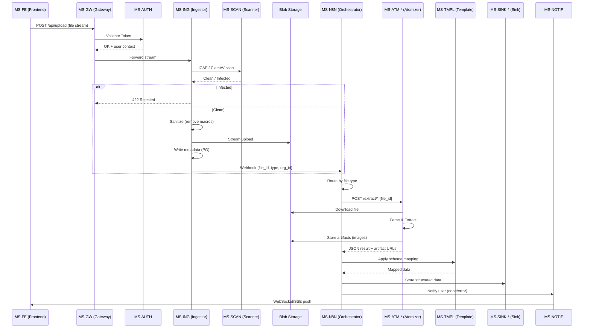
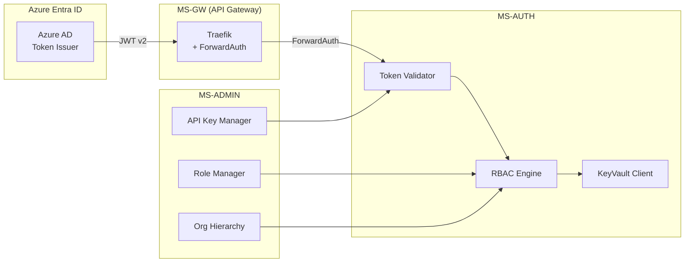
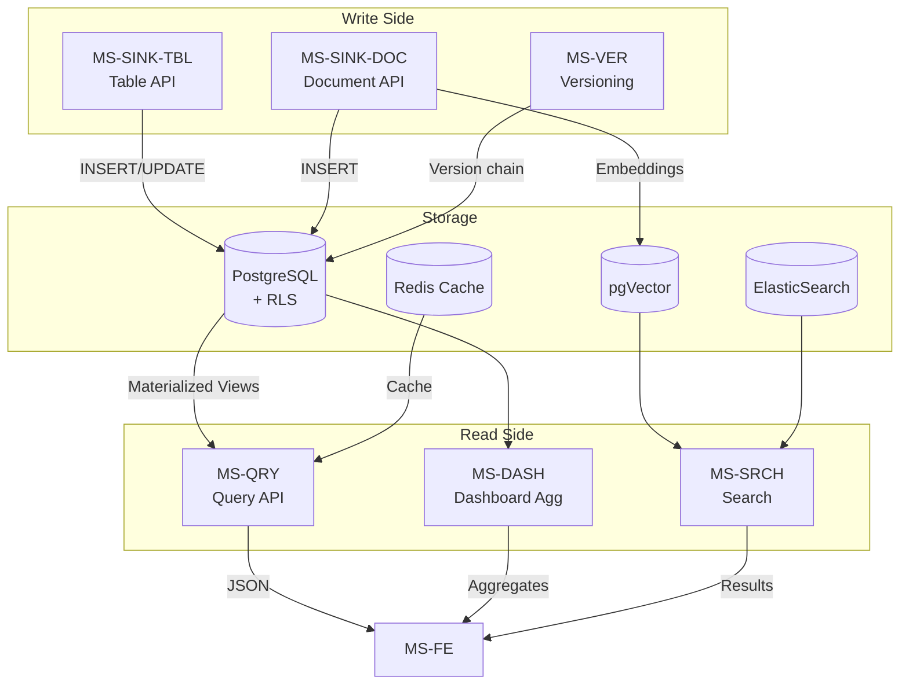
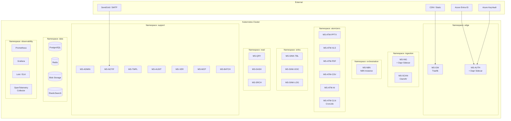
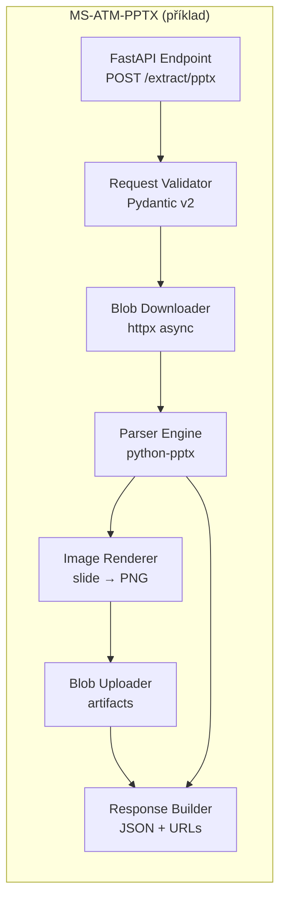

# Microservices Decomposition – PPTX Analyzer & Automation Platform
**Version:** 2.0
**Based on:** `docs/project_charter.md` v4.0
**Date:** 2026-03-09

---

## 0. HighLevel

```mermaid
graph TD
    User[User / React App] -->|HTTPS| FrontDoor[Azure Front Door / WAF]
    FrontDoor -->|Private Link| ACAEnv[Azure Container Apps Environment]
    
    subgraph "Compute Layer (ACA)"
        Ingress[Ingress Controller] --> Ingest[Ingestor Service]
        Ingest -->|Dapr PubSub| N8N[N8N Orchestrator]
        N8N -->|HTTP| AtomJava[Java Atomizer]
        N8N -->|HTTP| AtomPy[Python Atomizer]
    end

    subgraph "Data Layer"
        Ingest -->|Stream| Blob[Blob Storage]
        AtomJava -->|Read| Blob
        AtomPy -->|Read| Blob
```

---

## 1. Celkový přehled architektury (High-Level)

```mermaid
graph TB
    subgraph "Presentation Layer"
        FE[MS-FE<br/>Frontend SPA]
    end

    subgraph "Edge Layer"
        GW[MS-GW<br/>API Gateway]
        AUTH[MS-AUTH<br/>Auth Service]
    end

    subgraph "Ingestion Layer"
        ING[MS-ING<br/>File Ingestor]
        SCAN[MS-SCAN<br/>Security Scanner]
        BLOB[(Blob Storage)]
    end

    subgraph "Orchestration Layer"
        N8N[MS-N8N<br/>N8N Orchestrator]
        DLQ[MS-DLQ<br/>Dead Letter Queue]
    end

    subgraph "Processing Layer – Atomizers"
        ATM-PPTX[MS-ATM-PPTX<br/>PPTX Atomizer]
        ATM-XLS[MS-ATM-XLS<br/>Excel Atomizer]
        ATM-PDF[MS-ATM-PDF<br/>PDF/OCR Atomizer]
        ATM-CSV[MS-ATM-CSV<br/>CSV Atomizer]
        ATM-AI[MS-ATM-AI<br/>AI Gateway]
        ATM-CLN[MS-ATM-CLN<br/>Cleanup Worker]
    end

    subgraph "Persistence Layer – Sinks"
        SINK-TBL[MS-SINK-TBL<br/>Table API]
        SINK-DOC[MS-SINK-DOC<br/>Document API]
        SINK-LOG[MS-SINK-LOG<br/>Log API]
    end

    subgraph "Read / Analytics Layer"
        QRY[MS-QRY<br/>Query API]
        DASH[MS-DASH<br/>Dashboard Aggregation]
        SRCH[MS-SRCH<br/>Search Service]
    end

    subgraph "Support Services"
        NOTIF[MS-NOTIF<br/>Notification Center]
        ADMIN[MS-ADMIN<br/>Admin Backend]
        TMPL[MS-TMPL<br/>Template Registry]
        AUDIT[MS-AUDIT<br/>Audit Service]
        VER[MS-VER<br/>Versioning Service]
    end

    subgraph "Data Stores"
        PG[(PostgreSQL)]
        REDIS[(Redis)]
        VECTOR[(pgVector)]
        ES[(ElasticSearch/FTS)]
    end

    FE -->|HTTPS| GW
    GW --> AUTH
    GW --> ING
    GW --> QRY
    GW --> ADMIN
    GW --> NOTIF

    ING --> SCAN
    ING --> BLOB
    ING -->|webhook| N8N

    N8N --> ATM-PPTX
    N8N --> ATM-XLS
    N8N --> ATM-PDF
    N8N --> ATM-CSV
    N8N --> ATM-AI
    N8N --> SINK-TBL
    N8N --> SINK-DOC
    N8N --> SINK-LOG
    N8N --> TMPL
    N8N --> DLQ

    ATM-PPTX --> BLOB
    ATM-XLS --> BLOB
    ATM-PDF --> BLOB

    SINK-TBL --> PG
    SINK-DOC --> PG
    SINK-DOC --> VECTOR
    SINK-LOG --> PG

    QRY --> PG
    QRY --> REDIS
    DASH --> PG
    SRCH --> ES

    AUDIT --> PG
    VER --> PG
    NOTIF --> REDIS

    ATM-CLN --> BLOB
```



---

## 2. Detail – Ingestion & Processing Flow



---

## 3. Detail – Auth & RBAC Flow



---

## 4. Detail – Data Persistence & Read Model (CQRS)



---

## 5. Katalog Microservices (Units)

| # | Unit ID | Function ID | Název | Popis | FeatureSet | Tech Stack | Effort |
|---|---------|-------------|-------|-------|------------|------------|--------|
| 1 | MS-FE | **MS-FE** | Frontend SPA | React SPA – upload, viewer, dashboardy, notifikace (WebSocket/SSE), MSAL auth | FS09, FS11 | React 18 + Vite + TS + Tailwind | **XL** |
| 2 | MS-GW | **MS-GW** | API Gateway | Traefik reverse proxy – routing, SSL terminace, rate limiting, ForwardAuth | FS01 | Traefik (config) | **S** |
| 3 | MS-CORE | **MS-AUTH** | Auth Service | Validace Azure Entra ID tokenů, RBAC engine, KeyVault integrace, API key validace | FS01, FS07 | Java 21 + Spring Boot | **L** |
| 4 | MS-INGESTOR | **MS-ING** | File Ingestor | Streaming upload do Blob, MIME validace, metadata zápis, sanitizace, trigger N8N webhook | FS02 | Java 21 + Spring Boot | **L** |
| 5 | MS-INGESTOR | **MS-SCAN** | Security Scanner | Antivirová kontrola přes ICAP/ClamAV sidecar | FS02 | ClamAV (sidecar/container) | **S** |
| 6 | MS-N8N | **MS-N8N** | N8N Orchestrator | Business workflow engine – routing, batch processing, retry, circuit breaker, DLQ | FS04 | N8N (JSON workflows) | **L** |
| 7 | MS-PROCESSOR | **MS-ATM-PPTX** | PPTX Atomizer | Extrakce struktury, textů, tabulek a slide images z PPTX souborů | FS03 | Python + FastAPI | **L** |
| 8 | MS-PROCESSOR | **MS-ATM-XLS** | Excel Atomizer | Parsování Excel souborů per-sheet do JSON, partial success handling | FS03, FS10 | Python + FastAPI | **M** |
| 9 | MS-PROCESSOR | **MS-ATM-PDF** | PDF/OCR Atomizer | OCR a extrakce textu ze skenovaných PDF dokumentů | FS03 | Python + FastAPI | **M** |
| 10 | MS-PROCESSOR | **MS-ATM-CSV** | CSV Atomizer | Konverze CSV souborů na strukturovaný JSON | FS03 | Python + FastAPI | **S** |
| 11 | MS-AI | **MS-ATM-AI** | AI Gateway | LiteLLM integrace pro sémantickou analýzu, MetaTable logic, cost control (quotas) | FS03, FS12 | Python + FastAPI | **L** |
| 12 | MS-PROCESSOR | **MS-ATM-CLN** | Cleanup Worker | Cron/sidecar pro mazání dočasných souborů z Blob storage po expiraci | FS03 | Python (CronJob) | **S** |
| 13 | MS-DATA | **MS-SINK-TBL** | Table API (Sink) | Ukládání strukturovaných dat (tabulky, OPEX) do PostgreSQL | FS05 | Java 21 + Spring Boot | **M** |
| 14 | MS-DATA | **MS-SINK-DOC** | Document API (Sink) | Ukládání nestrukturovaného JSONu + vector embeddings (pgVector) | FS05 | Java 21 + Spring Boot | **M** |
| 15 | MS-DATA | **MS-SINK-LOG** | Log API (Sink) | Audit trail zpracování souborů – zápis processing logů | FS05 | Java 21 + Spring Boot | **S** |
| 16 | MS-DATA | **MS-QRY** | Query API (Read) | CQRS read model – optimalizované čtení pro frontend, caching (Redis) | FS06 | Java 21 + Spring Boot | **M** |
| 17 | MS-DATA | **MS-DASH** | Dashboard Aggregation | Endpointy pro grafy, souhrny, Group By / Sort, SQL nad JSON tabulkami | FS06, FS11 | Java 21 + Spring Boot | **L** |
| 18 | MS-DATA | **MS-SRCH** | Search Service | Full-text search přes ElasticSearch / PostgreSQL FTS + vector search | FS06 | Java 21 + Spring Boot | **M** |
| 19 | MS-CORE | **MS-ADMIN** | Admin Backend | Správa rolí (Admin/Editor/Viewer), holdingová hierarchie, secrets, API keys, Failed Jobs UI | FS07, FS08 | Java 21 + Spring Boot | **L** |
| 20 | MS-CORE | **MS-NOTIF** | Notification Center | In-app notifikace (WebSocket/SSE), e-mail alerty (SMTP/SendGrid), granulární nastavení | FS13 | Java 21 + Spring Boot | **M** |
| 21 | MS-DATA | **MS-TMPL** | Template & Schema Registry | UI pro mapování sloupců, learning z historie, voláno z N8N před uložením | FS15 | Java 21 + Spring Boot | **L** |
| 22 | MS-CORE | **MS-VER** | Versioning Service | Verzování dat (v1→v2), diff tool pro zobrazení změn mezi verzemi | FS14 | Java 21 + Spring Boot | **M** |
| 23 | MS-CORE | **MS-AUDIT** | Audit & Compliance | Immutable logy (kdo-kdy-co), read access log, AI audit (prompty/odpovědi), export | FS16 | Java 21 + Spring Boot | **M** |
| 24 | MS-AI | **MS-MCP** | MCP Server (AI Agent) | Integrace AI agentů, On-Behalf-Of flow, token dědění, quotas | FS12 | Python + FastAPI | **L** |
| 25 | MS-CORE | **MS-BATCH** | Batch & Org Service | Seskupování souborů do batchů, holdingová metadata, RLS enforcement | FS08 | Java 21 + Spring Boot | **M** |
| 26 | MS-REPORTING | **MS-LIFECYCLE** | Report Lifecycle Service | Správa stavového automatu reportů, submission checklist, rejection flow, hromadné akce | FS17 | Java 21 + Spring Boot | **L** |
| 27 | MS-REPORTING | **MS-TMPL-PPTX** | PPTX Template Manager | Nahrávání, verzování a správa PPTX šablon; extrakce placeholderů; mapování na datové zdroje | FS18 | Java 21 + Spring Boot | **L** |
| 28 | MS-AI | **MS-GEN-PPTX** | PPTX Generator | Renderování PPTX ze zdrojových dat + šablony; placeholder substituce; grafy; batch generování | FS18 | Python + FastAPI (python-pptx, matplotlib) | **L** |
| 29 | MS-REPORTING | **MS-FORM** | Form Builder & Data Collection | Definice formulářů, správa verzí, sběr dat, validace, Excel import, napojení na MS-LIFECYCLE | FS19 | Java 21 + Spring Boot | **XL** |
| 30 | MS-REPORTING | **MS-PERIOD** | Reporting Period Manager | Správa period a deadlinů, automatické uzavírání, completion tracking, eskalace, historické srovnání | FS20 | Java 21 + Spring Boot | **M** |

---

## 6. Effort Legenda

| Effort | Story Points (odhad) | Popis |
|--------|----------------------|-------|
| **S** | 3–5 | Jednoduchá služba, konfigurace nebo thin wrapper |
| **M** | 8–13 | Středně komplexní služba s vlastní business logikou |
| **L** | 13–21 | Komplexní služba s více endpointy, integrací a edge cases |
| **XL** | 21–34 | Rozsáhlá komponenta s mnoha obrazovkami / moduly |

---

## 7. Detail – Deployment Topology



---

## 8. Detail – Atomizer Internal Architecture



---

## 9. Komunikační matice (Dapr)

| Caller | Callee | Protokol | Typ |
|--------|--------|----------|-----|
| MS-GW | MS-AUTH | REST (ForwardAuth) | Sync |
| MS-GW | MS-ING | REST | Sync |
| MS-GW | MS-QRY | REST | Sync |
| MS-ING | MS-SCAN | ICAP / gRPC | Sync |
| MS-ING | MS-N8N | REST (Webhook) | Async (fire & forget) |
| MS-N8N | MS-ATM-* | REST | Sync (within workflow) |
| MS-N8N | MS-SINK-* | REST | Sync |
| MS-N8N | MS-TMPL | REST | Sync |
| MS-N8N | MS-NOTIF | REST / Pub-Sub | Async |
| MS-NOTIF | MS-FE | WebSocket / SSE | Push |
| MS-QRY | Redis | TCP | Cache lookup |
| MS-SINK-* | PostgreSQL | TCP | Write |
| MS-AUDIT | PostgreSQL | TCP | Append-only write |

---

## 10. Doporučený rollout (fáze)

### Phase 1 – MVP Core (FS01 + FS02 + FS03-PPTX + FS04 + FS05 + FS09-basic)
> MS-GW, MS-AUTH, MS-ING, MS-SCAN, MS-N8N, MS-ATM-PPTX, MS-SINK-TBL, MS-SINK-DOC, MS-SINK-LOG, MS-FE (upload + viewer)

### Phase 2 – Extended Parsing (FS03-rest + FS10 + FS06)
> MS-ATM-XLS, MS-ATM-PDF, MS-ATM-CSV, MS-ATM-CLN, MS-QRY, MS-DASH

### Phase 3a – Intelligence & Admin (FS07 + FS08 + FS12 + FS15)
> MS-ADMIN, MS-BATCH, MS-ATM-AI, MS-MCP, MS-TMPL

### Phase 3b – Reporting Lifecycle (FS17 + FS20)
> MS-LIFECYCLE, MS-PERIOD, MS-N8N (rozšíření), MS-FE (rozšíření)

### Phase 3c – Form Builder (FS19)
> MS-FORM, MS-SINK-TBL (rozšíření), MS-FE (rozšíření)

### Phase 4a – Enterprise Features (FS11 + FS13 + FS14 + FS16)
> MS-NOTIF, MS-VER, MS-AUDIT, MS-SRCH, MS-DASH (extended)

### Phase 4b – PPTX Report Generation (FS18)
> MS-TMPL-PPTX, MS-GEN-PPTX, MS-N8N (rozšíření), MS-FE (rozšíření)

### Phase 5 – DevOps Maturity (FS99)
> Observability stack (Prometheus, Grafana, Loki, OpenTelemetry), CI/CD pipelines, Tilt/Skaffold local dev

### Phase 6 – Local Scope & Advanced Analytics (FS21)
> MS-FORM (rozšíření), MS-TMPL-PPTX (rozšíření), MS-ADMIN (rozšíření), MS-FE (rozšíření)

### Phase 7 – Advanced Period Comparison (FS22 – placeholder)
> MS-DASH (rozšíření), MS-PERIOD (rozšíření)
