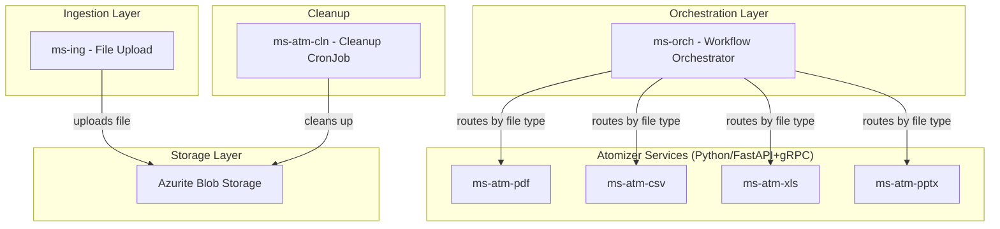

# P2-W2 Implementation Plan: Simpler Atomizers & Cleanup

## Overview
This plan implements 4 deliverables from the P2_W2_parsing_simple.md task:
1. **MS-ATM-PDF** - PDF/OCR Atomizer (7 MD)
2. **MS-ATM-CSV** - CSV Atomizer (2 MD)
3. **MS-ATM-CLN** - Cleanup Worker CronJob (2 MD)
4. **MS-ORCH Extension** - Multi-Format Router updates (3 MD)

---

## Architecture



---

## Implementation Details

### 1. MS-ATM-PDF Service
**Location:** `apps/processor/microservices/units/ms-atm-pdf`

**Files to create:**
- `pyproject.toml` - Dependencies: PyPDF2, pdfplumber, pytesseract, Pillow
- `Dockerfile` - Python 3.12 + Tesseract + language packs (ces, eng, deu)
- `src/config.py` - Service configuration
- `src/main.py` - Entry point
- `src/client/blob_client.py` - Blob storage client
- `src/models/context.py` - RequestContext extraction
- `src/service/pdf_parser.py` - Text extraction + OCR logic
- `src/service/pdf_service.py` - gRPC servicer

**Key Features:**
- Try text extraction first (PyPDF2/pdfplumber)
- OCR fallback with Tesseract if text layer empty
- Language support: Czech, English, German
- Confidence score per page
- Table extraction via pdfplumber
- Page-by-page processing

### 2. MS-ATM-CSV Service
**Location:** `apps/processor/microservices/units/ms-atm-csv`

**Files to create:**
- `pyproject.toml` - Dependencies: pandas, chardet
- `Dockerfile` - Python 3.12 slim
- `src/config.py` - Service configuration
- `src/main.py` - Entry point
- `src/client/blob_client.py` - Blob storage client
- `src/models/context.py` - RequestContext extraction
- `src/service/csv_parser.py` - Auto-detection logic
- `src/service/csv_service.py` - gRPC servicer

**Key Features:**
- Delimiter auto-detection: `,`, `;`, `|`, `\t` (frequency analysis)
- Encoding auto-detection: UTF-8, Windows-1250, ISO-8859-2 (chardet)
- Header row detection (heuristic)
- Data type inference per column

### 3. MS-ATM-CLN Cleanup Worker
**Location:** `apps/processor/microservices/units/ms-atm-cln`

**Files to create:**
- `pyproject.toml` - Dependencies: azure-storage-blob
- `Dockerfile` - Python 3.12 slim
- `src/config.py` - Service configuration
- `src/main.py` - Entry point (CronJob)
- `src/cleanup_worker.py` - Cleanup rules

**Cleanup Rules:**
- Delete temporary PNG slides from Blob > 24 hours old
- Delete temporary CSV exports > 24 hours old
- Delete `_raw/` original files > 90 days old
- Delete temporary generator output files > 24 hours old
- Dry-run mode for testing
- Logging of deleted files count and freed storage

### 4. MS-ORCH Extension
**Location:** `apps/engine/microservices/units/ms-orch`

**Updates:**
- FileTypeRouter.java - Already has mappings for PDF and CSV
- Create `pdf_workflow.json` - Workflow definition for PDF processing
- Create `csv_workflow.json` - Workflow definition for CSV processing
- Update docker-compose.yml with new service entries

---

## Docker Compose Updates

Add to `infra/docker/docker-compose.yml`:

```yaml
ms-atm-pdf:
  build: ../../apps/processor/microservices/units/ms-atm-pdf
  environment:
    - DAPR_HOST=dapr
    - DAPR_HTTP_PORT=3500
    - DAPR_GRPC_PORT=50001
  ports:
    - "8090:50051"

ms-atm-csv:
  build: ../../apps/processor/microservices/units/ms-atm-csv
  environment:
    - DAPR_HOST=dapr
    - DAPR_HTTP_PORT=3500
    - DAPR_GRPC_PORT=50001
  ports:
    - "8093:50051"

ms-atm-cln:
  build: ../../apps/processor/microservices/units/ms-atm-cln
  environment:
    - DAPR_HOST=dapr
    - DAPR_HTTP_PORT=3500
  cron: "0 * * * *"  # Every hour
```

---

## Acceptance Criteria

### MS-ATM-PDF
- [ ] Text PDF → extracted directly (fast path)
- [ ] Scanned PDF → OCR with confidence > 0.8
- [ ] Mixed PDF (some pages text, some scanned) → correct detection per page

### MS-ATM-CSV
- [ ] Semicolon-delimited Czech CSV correctly parsed
- [ ] Windows-1250 encoding auto-detected

### MS-ATM-CLN
- [ ] Runs as CronJob every hour
- [ ] Dry-run mode works
- [ ] Logs deleted files count and freed storage

### MS-ORCH Extension
- [ ] .xlsx → MS-ATM-XLS routing works
- [ ] .pdf → MS-ATM-PDF routing works
- [ ] .csv → MS-ATM-CSV routing works
