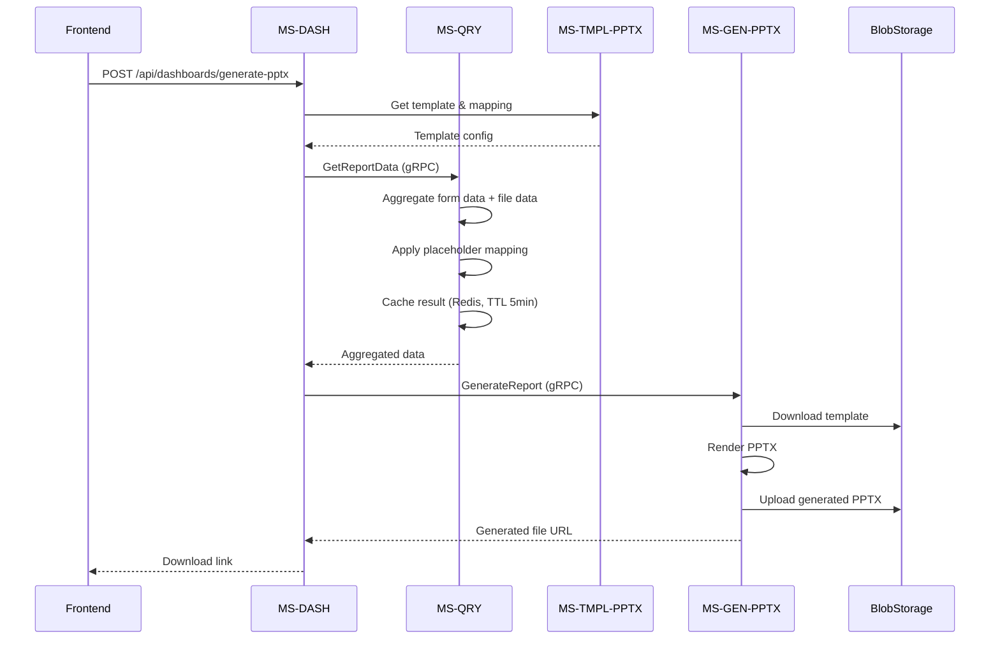

# P4b Implementation Plan: Waves 2 & 3

**Created:** 2026-03-12
**Status:** Ready for Review
**Based on:** P4b_W2_generator_data.md & P4b_W3_generator_config.md

---

## Overview

This plan covers the implementation of:
- **P4b-W2**: Data Aggregation for Generator
- **P4b-W3**: Configuration (Docker + Sample Templates)

---

## P4b-W2: Data Aggregation for Generator

### P4b-W2-001: MS-QRY Extension – Report Data Aggregation

**Location:** `apps/engine/microservices/units/ms-qry`

**Tasks:**

1. **Create new proto file** `packages/protos/generator/v1/report_data.proto`:
   ```protobuf
   service ReportDataService {
     rpc GetReportData(GetReportDataRequest) returns (GetReportDataResponse);
   }
   
   message GetReportDataRequest {
     string report_id = 1;
     RequestContext context = 2;
   }
   
   message GetReportDataResponse {
     string report_id = 1;
     map<string, string> text_placeholders = 2;
     repeated GeneratorTableData tables = 3;
     repeated GeneratorChartData charts = 4;
   }
   ```

2. **Add gRPC endpoint** to MS-QRY:
   - Create `ReportDataGrpcController.java` 
   - Implement `GetReportData(report_id)` that:
     - Fetches form responses for the report
     - Fetches uploaded file data
     - Applies placeholder mapping from MS-TMPL-PPTX
     - Aggregates data: sum/avg for TABLE, time series for CHART, text for TEXT

3. **Add Redis caching** (TTL 5 minutes):
   - Cache key: `report_data:{report_id}`
   - Invalidate on data change events

**Files to create/modify:**
- `packages/protos/generator/v1/report_data.proto` (NEW)
- `apps/engine/microservices/units/ms-qry/src/main/java/com/reportplatform/qry/grpc/ReportDataGrpcController.java` (NEW)
- `apps/engine/microservices/units/ms-qry/src/main/java/com/reportplatform/qry/service/ReportDataAggregationService.java` (NEW)
- Update `pom.xml` to include generator proto

---

### P4b-W2-002: MS-DASH Extension – Generator Trigger

**Location:** `apps/engine/microservices/units/ms-dash`

**Tasks:**

1. **Add REST endpoint** `POST /api/dashboards/generate-pptx`:
   - Request body: `{ dashboard_id, template_id? }`
   - Uses pre-configured template from MS-TMPL-PPTX (or default)
   - Triggers MS-GEN-PPTX via Dapr gRPC

2. **Dashboard export as PPTX**:
   - Fetch dashboard data via existing aggregation service
   - Map dashboard metrics to template placeholders
   - Call MS-GEN-PPTX.GenerateReport
   - Return generated file URL

**Files to create/modify:**
- `apps/engine/microservices/units/ms-dash/src/main/java/com/reportplatform/dash/controller/DashboardGenerateController.java` (NEW)
- `apps/engine/microservices/units/ms-dash/src/main/java/com/reportplatform/dash/service/DashboardPptxService.java` (NEW)
- `apps/engine/microservices/units/ms-dash/src/main/resources/db/migration/V2__add_pptx_generation_tables.sql` (NEW - if needed)

---

## P4b-W3: Configuration

### P4b-W3-001: Docker Compose – P4b Services

**Location:** `infra/docker/docker-compose.yml`

**Tasks:**

1. **Add LibreOffice headless container** for validation:
   ```yaml
   libreoffice:
     image: libreoffice:stable
     container_name: libreoffice
     command: --headless --invisible --norestore
     networks:
       - report-net
   ```

2. **Verify existing services** are properly configured:
   - MS-GEN-PPTX (port 8105) ✓ Already present
   - MS-TMPL-PPTX (port 8104) ✓ Already present
   - Dapr sidecar configs ✓ Already present
   - Nginx routing `/api/templates/pptx/*` → MS-TMPL-PPTX ✓ Already present

3. **Add validation script** to MS-GEN-PPTX Dockerfile that uses LibreOffice to validate generated PPTX files

**Files to modify:**
- `infra/docker/docker-compose.yml` (ADD libreoffice service)

---

### P4b-W3-002: Sample PPTX Templates

**Location:** `tests/fixtures/templates/`

**Tasks:**

1. **Create sample PPTX template** with placeholders:
   - Text: `{{company_name}}`, `{{period}}`, `{{total_opex}}`
   - Table: `{{TABLE:opex_summary}}`
   - Chart: `{{CHART:monthly_trend}}`

2. **Create sample mapping configuration** `mapping-config.json`:
   ```json
   {
     "template_name": "Sample Financial Report",
     "version": "1.0",
     "placeholders": {
       "company_name": { "source": "form_field", "field": "organization_name" },
       "period": { "source": "form_field", "field": "reporting_period" },
       "total_opex": { "source": "aggregated", "calculation": "sum", "field": "opex_amount" },
       "TABLE:opex_summary": { "source": "table", "table_name": "opex_details" },
       "CHART:monthly_trend": { "source": "time_series", "metric": "monthly_costs" }
     }
   }
   ```

3. **Create sample data** for testing

**Files to create:**
- `tests/fixtures/templates/sample_report.pptx` (NEW - actual PPTX file)
- `tests/fixtures/templates/mapping-config.json` (NEW)
- `tests/fixtures/templates/sample_data.json` (NEW)

---

## Implementation Sequence

```
P4b-W2-001: MS-QRY Extension
├── 1.1 Create proto file (generator/v1/report_data.proto)
├── 1.2 Add gRPC servicer to MS-QRY
├── 1.3 Implement data aggregation service
└── 1.4 Add Redis caching

P4b-W2-002: MS-DASH Extension
├── 2.1 Add REST controller
├── 2.2 Implement PPTX generation service
└── 2.3 Integrate with MS-GEN-PPTX

P4b-W3-001: Docker Compose
├── 3.1 Add LibreOffice container
└── 3.2 Add validation to MS-GEN-PPTX

P4b-W3-002: Sample Templates
├── 4.1 Create PPTX template with placeholders
├── 4.2 Create mapping configuration
└── 4.3 Add sample test data
```

---

## Dependencies

- **MS-TMPL-PPTX** (existing): Template management
- **MS-GEN-PPTX** (existing): PPTX generation
- **MS-LIFECYCLE** (existing): Report status management
- **MS-FORM** (existing): Form responses
- **Redis** (existing): Caching
- **Dapr** (existing): Service-to-service communication

---

## Mermaid: Data Flow



---

## Ready for Implementation

This plan is based on your preferences:
- ✅ NEW proto in generator/v1/report_data.proto
- ✅ Pre-configured template from MS-TMPL-PPTX for dashboard export
- ✅ LibreOffice for validation only
- ✅ Placeholders from task spec: `{{company_name}}`, `{{period}}`, `{{TABLE:opex_summary}}`, `{{CHART:monthly_trend}}`

**Please review and approve to proceed with implementation.**
